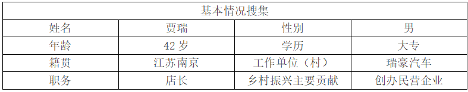

# 南京

访谈记录

## 好又多超市张敏

**陈雅新（采访人）**：您之前是否听说过“四千四万”精神？对“四千四万”精神了解程度如何？

**张敏（受访人）**：有听过，算比较了解吧。

**陈雅新**：在践行“四千四万”精神的实践中，您的主要经历是怎样的？

**张敏**：一开始创办这个超市是为了挣钱，然后还有为了生活得更好。因为我们的家族做这方家族的生意，仓储生意仓后来转型为超市。其实创办这个超市前期的困难非常大，像超市的话一般省电比较难一点，还有进货方面的都需要自己慢慢的去磨合，慢慢的去改正。各方面，还有一些其他的一些问题然后慢慢的时间才能沉淀才会做的慢慢越来越好。尤其各方面的货物商品的价格需要去调剂，还有商品的物品需要去调货调配。

**陈雅新**：您是我们的前辈和榜样，借这个机会，想请您给我们广大青年朋友提一些希望和建议，尤其是您认为“四千四万”精神对于年轻一代的企业家和创业者有什么启示和价值吗？

**张敏**：市场方面非常的还是很挺明了挺明朗，希望以后各自在这方面的行业能够更进一步吧。

**陈雅新**：非常感谢您的配合和支持，我们希望通过这次访谈能够更深入地了解“四千四万”精神的认知、实践现状，为提出“四千四万”精神的传承发展路径提供参考。如果您有任何其他的问题或建议，也请随时告诉我们。再次感谢您的参与！

## 瑞豪汽车贾瑞
 

**陈雅新（采访人）**：您之前是否听说过“四千四万”精神？对“四千四万”精神了解程度如何？

**贾瑞（受访人）**：有听过，算比较了解吧。

**陈雅新**：在践行“四千四万”精神的实践中，您的主要经历是怎样的？

**贾瑞**：我从事汽车租赁行业20多年。平时的工作就主要就是保障政府用车啊事业单位企业还有这个学校，主要是保障他们用车，做一些后勤保障。我当时就是退伍嘛，当兵四年然后就退伍，在部队就学了一个开车嘛，会开车当时就看人家搞这行，退伍了以后也没有工作嘛，然后这个到了地方就看人家干挺好，我们也就学的干挺好，然后就一台车变两台车这样子的。这当然中途吃苦太多了，干司机这个是挺辛苦的，从早到晚起早贪黑的，那没办法这事。还好我们干这行没什么困难，反正就开车，主要就是得保障好这个车辆的，首先是车辆这个维修保养好，另外一个就是服务企业事业单位嘛把人家服务好就行了，也没什么，我们这行还好。

**陈雅新**：您是我们的前辈和榜样，借这个机会，想请您给我们广大青年朋友提一些希望和建议，尤其是您认为“四千四万”精神对于年轻一代的企业家和创业者有什么启示和价值吗？

**贾瑞**：这个年代，这个世道就是吃苦耐劳，没什么别的，就是勤快点，吃苦耐劳，没什么捷径，只要肯吃苦，还是能挣到钱的。

**陈雅新**：非常感谢您的配合和支持，我们希望通过这次访谈能够更深入地了解“四千四万”精神的认知、实践现状，为提出“四千四万”精神的传承发展路径提供参考。如果您有任何其他的问题或建议，也请随时告诉我们。再次感谢您的参与！

## 南京迪升动力科技有限公司	钱永贵
https://mp.weixin.qq.com/s/BAv1j1q3wudoJ7lAW-xI3w

## 南京弘毅电气自动化有限公司	田伟
https://mp.weixin.qq.com/s/xb7kCKNVRN5gAX-vO1r5ig

## 南京天加环境科技有限公司	蒋立
https://mp.weixin.qq.com/s/kskKCSVCfMm2dFhZLuMB1Q

## 三胞集团	袁亚非
https://mp.weixin.qq.com/s/PrXns41zLckEkxhNolKQGw

## 南京电气高压套管有限公司	陈雄清
https://mp.weixin.qq.com/s/QtlrOwBOuxQBL51yA31w1Q

## 孩子王	汪建国
https://mp.weixin.qq.com/s/XbJost4RcSdQ1OfXgQIJtw

## 江苏叁拾叁信息技术有限公司	张梓强
https://mp.weixin.qq.com/s/j3MzO99dC8-ua4LZdpL6ZQ

## 江苏龙蟠科技股份有限公司	石俊峰
https://mp.weixin.qq.com/s/mDUGmcdAPxqjmeKZJcnTmg

## 南京聚隆科技股份有限公司	吴汾
https://mp.weixin.qq.com/s/FsXtyS9NICmeMBG5gapaGA

## 江苏芯德半导体科技股份有限公司	张国栋
https://mp.weixin.qq.com/s/b_nLw9twPlxxrUfGqX4GeQ

## 福佑卡车	单丹丹
https://mp.weixin.qq.com/s/sAeNnoUTq7XTsPZ1EGvbYQ

##3D打印药物企业三迭纪医药科技有限公司	成森平
https://mp.weixin.qq.com/s/J-XVnS-ddsHkwTeB-9g6lQ

## 江苏零浩	蒋明辉
https://mp.weixin.qq.com/s/ThWejJaTiRX9m6xU0cnHtw

## 江苏高淳陶瓷股份有限公司	尚仲禹
https://mp.weixin.qq.com/s/1JmpjP2H5fQYRMKPYozMww

## 南京蓝昊智能科技有限公司	费秀峰
https://mp.weixin.qq.com/s/hlK2YyIw0qTNFxE8YOSfGQ

## 五星投资	汪建国
https://mp.weixin.qq.com/s/BIsyB4RFtwK0vf8885QZtA

## 金箔控股集团	江宝全
https://mp.weixin.qq.com/s/pVh2peiw-Dm9cwvJSnFQzA

## 南京市工大数控科技有限公司	于春建
https://mp.weixin.qq.com/s/KRl_C2PyZ4rLfXFnb890ug

## 红太阳集团	杨寿海
https://mp.weixin.qq.com/s/w1Xso5p93a1ClEg_g9eWdA

## 南京创力传动机械有限公司	费秀国
https://mp.weixin.qq.com/s/Zph1zzbIqyvRhQE0wzOzUg

## 南京高华科技股份有限公司	李维平
https://mp.weixin.qq.com/s/2Y1u_bnYkZd53WAxyntCpw

## 南京诺尔曼生物技术股份有限公司	何仕钊
https://mp.weixin.qq.com/s/89uyNMfqLJs7YRKju5b42w

## 江苏美思德化学股份有限公司	孙宇
https://mp.weixin.qq.com/s/Ldl_ttedWIQty2DNawaI8w

## 江苏天辰智能装备有限公司	宗海啸
https://mp.weixin.qq.com/s/fZd8RWCyUQjJz0pajhBuGg

## 江苏锦恒电器设备有限公司	傅顺
https://mp.weixin.qq.com/s/p9S_sB6lmRTJNIgE4aJsbA

## 南京驯鹿生物技术股份有限公司	张金华
https://mp.weixin.qq.com/s/VuiwhiHRrCYYgpU82QLv9Q

## 南京必格物联科技有限公司	林强
https://mp.weixin.qq.com/s/SvGWv2Us6cTrna3Un_EfOg

## 展拓消防集团	张爱玲
https://mp.weixin.qq.com/s/spdFSanYeW2ZFH0IvhJJ_w

## 江苏美润云汽车服务股份有限公司	孙智伟
https://mp.weixin.qq.com/s/sjjqXpGywL9IEO0mtQ1yvg

## 南京华助自动化技术有限公司	袁小俊
https://mp.weixin.qq.com/s/TZHjoBgl1UoogqsCu9EAmg

## 江苏金卓能技术有限公司	曹鹏
https://mp.weixin.qq.com/s/cApROSXgLhBqHv6V2CqW7Q

## AO史密斯	邱步
https://mp.weixin.qq.com/s/gCbdKGC9zrE5RpEkF8Eccg

## 天笑集团	厉航天
https://mp.weixin.qq.com/s/pPraM5a4TgtX5c2MQI8u9A

## 江苏久吾高科技股份有限公司	党建兵
https://mp.weixin.qq.com/s/iVbXMy8hvB5Fcs4np1yJ0g

## 南京理工科技园股份有限公司	郝英
https://mp.weixin.qq.com/s/P7ZppNX0EJZRmv81XtA66A

## 江苏宏坤供应链管理有限公司	孙晓青
https://mp.weixin.qq.com/s/P7ZppNX0EJZRmv81XtA66A

## 云帐房网络科技有限公司	薛兴华
https://mp.weixin.qq.com/s/9iJzUBPlYnoOe_4h3TDftA

## 江苏浪潮信息科技有限公司总经理	张剑
https://mp.weixin.qq.com/s/coAGicmFK5FGxUw5Jt9_Gg

## 南京金陵金箔股份有限公司	江楠
https://mp.weixin.qq.com/s/z-3vSK8liK_O0M3I-AilEw

## 开沃新能源汽车集团股份有限公司	黄宏生
https://mp.weixin.qq.com/s/wlB_PBPth9bvVub9svcfVw
