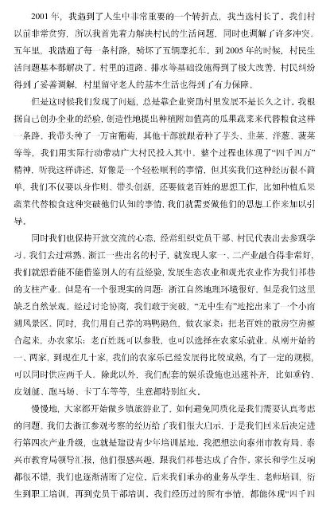
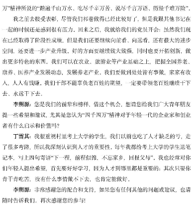

# 泰兴

访谈记录

## 祁巷村丁雪琪书记

## 凤灵集团李书

**李朔源（采访人）**：李总您好，我们是南京师范大学马克思主义学院的学生，我们今天来向您做一个采访。我们现在正在进行一项有关四千四万精神认知、实践以及传承、发展的调查研究，希望您能抽出时间配合我们做一个简短的访谈，谢谢！请问您之前是否听说过四千四万精神？

**李书（受访人）**：听说过。

**李朔源**：四千四万的含义就是踏尽千山万水、吃尽千辛万苦、说尽千言万语、历尽千难万险，在您的创业过程中是否体现了这些精神？

**李书**：我觉得人生就像一条河，有直有弯，每个人都会经历这样的“四千四万”，如果能把这四个方面都做好、都闯过去、都越过去，就一定能有所成就。我是从71年开始工作，从小家里很穷，条件很苦，16岁母亲去世，60年和61年饿死了两个弟弟，我18岁的时候也只有41公斤，一米四高，验了三年兵都没验上，所以当我出来工作的时候我就想我一定要奋斗、要努力，不管有多大的苦、多大的难、多大的险，我都要闯过去。不管在哪个岗位上我都给自己定了第一的目标，否则决不罢休。我最开始是在工厂学做小提琴头的，合格标准是一个月做6个，但我每天早上七点半就走路来工厂，中午两个小时休息，我只留半个小时吃饭，其他2024年11月3日时间我都在工作，晚上全厂都休息了，只有我一个人上班。别人都说工厂来了个“神经病”，但我觉得这不是拿工资的问题，是我要体现我个人的价值，所以我在厂工作几个月后就远远超过工厂的标准，也被提拔了当小干部。但是我当时想的是要学技术，不想当官，所以74年我就到了小提琴的装配区。从第一天上班开始，我就争做上班最早、下班最迟的人。当时定好了八小时的工作量，但我想做一点改革。做小提琴的同事说他一个小时能做25、26个，我觉得这么小的东西不需要这么久，同事便说这个零件很难做，工艺很复杂，如果不相信让我自己去做，但我当时还不会做，所以受了很大刺激。我向厂里的师傅请教，认真学了三天晚上，第四天就做出了琴马，一个早上，四个小时不到就做了176个，惊呆了同事们。后来到了75年，那是我最自豪的一年。我们当时工厂接了上海五千把吉他的订单，要求两个月内完成，但是我们当时一个月只能做15把吉他，按照原本的工作方式根本来不及，而且各岗位的工人也有大量不足。我从刚开始每天给工人们分配任务到实行24小时昼夜轮换工作的形式，成功跟26个工人一起完成了83个人的任务，任务完成后大家都抱在一起哭起来。后来在工厂的大会上我们还被点名表扬了。就是到现在，碰到厂里的老工人还是经常会提到这件事，大家都感到很自豪。76年我们又接了一个订单，当时工作量极大，我们同样是完成了双倍的任务。

**李朔源**：嗯嗯，听了您的分享我们真的深有感触，能体会到当时的艰辛。我们查找资料发现您的工厂在改革开放以后和上海的一些工厂有合作，能分享一下这段时间的经历吗?

**李书**：我觉得我们工厂运营要时刻跟着国家的政策走，我今天看了央视新闻，看到国家的新政策、新理念，我今天就要到工厂去落实。80年代，我接收到了国家对于城乡联合的号召，我们当时有13个分厂，我们是最小的一个，于是我就想跟上海的一个零件加工厂联合起来。我认为，不管做什么事情，自己都要有优势才能比别人做得更好。于是我就在12家工厂里来回跑，汲取他们的所有长处，主要集中在三个方面，一个是要在工厂里建造楼房，二是要尽可能地降低成本，三是整体的管理。在和上海工厂讨论联合时，我提出了两点，一是联合之后三年以内一定返还所有成本投入，第四年即可开始盈利。二是我会尽力打造自己的工厂，增加我们共同的影响力。最后，我熟练的说出日夜反复背诵过的制作过程涉及的368个数据，并用上海60%的成本成功拿下联合的事情。所以说，做任何事情都要做出十分的努力才能达到自己想要的结果。后来我们又跟广东、天津等地的工厂进行合作。92年，国家号召走工部联合的道路，我们跟上海最大的外贸公司进行了合作,95年，国家号召走引进外资的道路，我们跟美国的公司进行了合作。国家当时还号召走股份制的道路，我们也照此实行。到2000年，我们又跟随国家进行了企业改制，我们就这样跟随国家的改革开放一步步地发展进步。92年的时候我还到北京去，想从那里开始走遍千山万水，走到全国各地工厂区，走到国外去。从那时起，我们在全世界走，去到了很多地方，美国、德国、巴西等等。视野变得广阔之后，我认识到了我们与别人的差距，便买了德国、意大利和日本的小提琴回来研究学习，学习他们的优点。后来通过超高的品质和低廉的价格拿到了很多订单，各国人都纷纷前来。

**李朔源**：您刚刚说的那些经历对我们有很大的启发。最后，您是我们的前辈和榜样，借这个机会，想请您给我们广大青年朋友提一些希望和建议，尤其是您认为“四千四万”精神对于年轻一代的企业家和创业者有什么启示和价值吗？

**李书**：首先，我觉得，人一定要学会带头吃苦，就像当初工作的时候，我要做上班最早、下班最迟的人，企业家们也要这样，要把厂里的工人都看做家人一样，帮助他们做力所能及的事情，这样工人才会把工厂当作家。第二个我觉得人的一生会遇到很多风险，我们要学会预测，在美国要发生次贷危机前我就察觉到异常，于是将注意力转移到欧洲订单上，一个地方一个地方得跑，拿下来许多订单，最后没有受到美国的影响。后来在欧洲参加会议时我察觉到订单的异常，于是加强与亚洲国家的联系，拿下周边国家的订单，最终没有受到12年金融危机的影响。我们要学会预测这些千难万险，要走遍千山万水才能了解到更多的情况。经过四十多年的改革开放，中国现在可以说是最美丽、最安全、基础设施最完善的国家，你们作为新时代的大学生，第一一定要有吃苦的精神，就像习主席说的“一切幸福都是奋斗出来的”，我们要以高目标、高标准要求自己，要用赛跑的精神去学习、去成长；第二就是要有创新的精神。如果与他人一样，没有任何自身特色，因循守旧，是不会有很大的成就的，要在现有标准上要求更高。第三就是要用事情的最后结果来检验自己的努力，不要讲空话、讲大话，这些都是虚无的；第四就是要讲诚信，要做一个说到做到的人，要做一个懂得奉献懂得关心他人的人。

**李朔源**：好的！非常感谢您的配合，就像您刚才所说，我们青年大学生和企业家一定要实事求是，要有创新精神，为“四千四万”精神的传承和发展贡献我们的青年力量，接过祖国的接力棒！
## 宣堡村刘庆华

**李朔源（采访人）**：您之前是否听说过“四千四万”精神？对“四千四万”精神了解程度如何？

**刘庆华（受访人）**：听说过，应该说非常了解，我当年就是跑供销的。

**李朔源**：在践行“四千四万”精神的实践中，您的主要经历是怎样的？

**刘庆华**：我70年年满16岁就去当兵，在部队里干了几年，76年3月份返乡。返乡以后呢发现我们宣堡经济状况不咋样好，当时我们宣堡大队总产量不超过20个。江南呢走在我们前面，说实话到江南的气象跟我们形成了大的反差，在这个时候呢，我们也就有一种，我们身为泰兴人，同在江苏省，但是呢一江之隔形成了两个反差，我们走到江南去呢，都感到惭愧。为了改变面貌，说老实话由于当时各方面的体制机制不同，我们就想呢能不能为地方的经济，特别是地方的工业，做点自己的贡献呢。当时我们通过朋友介绍，自己先是创办了服装厂，服装厂在当时计划经济和市场经济并轨的时候，首先原料布就相当相当难采购。说实话，我们到浙江睡在人家织布机旁边，等人家织布机织布，人家织多少布我们拿多少回来。以后生产的服装，卖出去也艰苦啊。我还记得当时中长纤维裤子比较时兴，但是好多商场啊，对我们乡镇企业不认可，我们就往北方打开市场，我们基本每天一个县城跑当地百货公司。但是这个服装厂创办了三四年之后，市场上已经形成了这个市场结构了，我们乡镇企业陈旧啊，而且工人技术啊比不上江南那些大的服装企业啊。 以后呢，我们宣堡就创办了胶鞋厂。创办初期的时候，我说几个典型的事迹啊。我一开始没有去，后来马厂长喊我过去当销售，我们是上海大中华橡胶厂泰兴分厂。一开始进去的时候，当时的供销人员啊基本上把当时全国好啃得下来的百货店拿下来了。当时我都记得我们一把手书记说河北石家庄和包头百货站至今没有人去拿下。当时我们负责的领导跟我打赌，你能把它拿下来，我送个金戒指给你。我说我不拿下来，我送两个金戒指给你。看上去像是说的赌气的话，实际上是我不服气。当时石家庄百货站他那个科长虽然年纪不大，三十几岁，但是比较傲慢。他呢进货有他的老渠道，他不愿意购进新渠道。这个时候说老实话，我们为了找到他住的地方，费了老些劲。找到他住哪里，还要知道他这个人的作息习惯，他有时候起来比较早，起来去锻炼。他平时锻炼走的路径啊，我们还要去考察，以后呢就在路上拦住他，把我们的来意诚意告诉他，很希望他去试试看。总算哎他答应了半句头，说半个月后镇江订购会再见。我们也不厌其烦黏住他，他最后一次就给我们定了多少呢，200多。当时就是我们一把手书记都感到很惊讶的。拿回来之后呢，我就跟我们负责的领导开玩笑说，我也不要你的金戒指了，你请我吃一顿就行了。第二个包头百货站，科长哎是个老头，年纪比较大，也固执啊。我当时每天早上去叫他，他后来就说刘科长啊，我就凭你每天早上我还没起床你就去叫我这个诚意，我就订你的货。第二个案例呢我们就说北京进口公司，就向我们订购了一批出口俄罗斯。当时呢说老实话，我们家里面胶鞋厂，资金人员比较困难，而且呢这批产品的利润还是有的，但是呢比较严格贷不了款。当时旁的地方有个鞋装厂啊，他们积压了货，但是呢我们家里面出了好多人去找那个厂的一把手，当时怎么都不肯，除非给钱，后来就签了33万。回来生产的产品是腊月21集装箱装走了，腊月23厂里就叫我到北京去拿钱。当时我们书记就嘱咐我说，一定要把钱拿回来，我们全镇都要靠这个钱开销。我到北京公司之后，我就找他们财务处科长，财务处科长就朝我说，你的钱春节前肯定不可能解决。在这个时候我在那边等了三天，人家公司都在分年货了回去过年了，已经腊月26了。我去找科长，科长说老板脾气不好，资格比较老。在这个时候，我就找他办公室主任，我说我们乡镇都指望拿这个钱回去过年，如果这个钱不到家呢，我们厂里面的人就无法过年。这个主任呢非常同情，他说明天上午十点十五分，安排个时间让我见一下梁总，第二天十点钟我就坐那边等。后来我就跟老板说明情况，老板马上就跟财务处科长商量。老板马上就写了一个纸条写给中国银行总行，字条上写的字我到今天都记得，立马给他五十七万二。我到中国银行总行的时候啊，北京一环二环交通非常繁忙，我打了出租车，从三环饶了两个多小时，到那边的时候人家行长拿着饭盒子怪我们去迟了。后来行长直接在手写汇票，我拿了票之后，也顾不上吃饭，立马跑到北京机场，正月一十之前到南京的机票都没有了。这个时候说老实话，我心里很急啊。这个在我人生当中也比较典型。这个时候我就看见等着退票的窗口排了好些人，我就问人家干什么的，他们说我们等着飞机有了空位置就补票上去。我问有没有把握，他们说前面也走了七八个人呢，今天还有六班去上海的，然后我就在那边等。后来等到了位置回上海了。到上海十一点四十，我打了电话给书记，书记让我赶紧打车回来，后来终于到了宣堡。当时中国银行的汇票还要到扬州才能汇呢。这也算是我们作为供销员的苦哦。还有好多事哦，遇到的也多哦。

**李朔源**：您是我们的前辈和榜样，借这个机会，想请您给我们广大青年朋友提一些希望和建议，尤其是您认为“四千四万”精神对于年轻一代的企业家和创业者有什么启示和价值吗？

**刘庆华**：至于对以后的人有什么厚望，说老实话现在的人水平都比我们高，拿现在人比较的话，我们那时候那些方法都是原始的，现代人做这些事才是正儿八经的现代化。我们只希望他们有这么好的机遇，有这么好的时代，最好的话呢，能够比我们那时候做得更好。我们那时候哦说实话，从家里到北京，坐火车一个星期，还要去公安局开证明。过去住旅馆还要排号呢，不像现在随时随地住的，而且只能住一天，第二天还要去登记处领号。所以说现在和过去不能比。

**李朔源**：非常感谢您的配合和支持，我们希望通过这次访谈能够更深入地了解“四千四万”精神的认知、实践现状，为提出“四千四万”精神的传承发展路径提供参考。如果您有任何其他的问题或建议，也请随时告诉我们。再次感谢您的参与！
## 宣堡村刘敬元

**李朔源（采访人）**：四千四万的含义就是踏尽千山万水、吃尽千辛万苦、说尽千言万语、历尽千难万险，在您的创业过程中是否体现了这些精神？

**刘敬元（受访人）**：我是七九年高中毕业以后是应兵入伍。在部队三年。回乡以后就是我们刚开始是自谋职业，我是做木匠，但是考虑到木匠的发展前景不是很好，因此，就在我们乡镇企业里面打工。我是在一个鞋帮厂在里面学机修，学管理。后来开始自己创业，也想帮助更多社会上闲置的劳动力。刚开始，我是租用了闲置厂房，这里以前是农牧市场，但是由于被闲置了很多年，厂房里面的草长得一人多高，里面一塌糊涂。后来邻居和朋友都来帮忙，我们每天晚上都搞到十几点才休息，才把这里打扫整理干净。因为是刚开始投资，没有资金也没有设备，设备都只能租别人的旧设备。一天晚上我们跑到兴化的一个服装厂， 把人家的旧设备回来改装，但是厂房过于破旧，下雨天外面下大雨，里面下小雨，没有办法我们就去找车找人，到如皋去买彩钢板回来维修厂房。所有的设备、工人都准备好了之后，业务又成了我们最大的问题。我们找到常州的一个胶鞋厂，他们是江苏江苏省轻工的一个单位，通过多方的合作，我们的业务也逐渐正常。我们的质量是始终能够保证的，作为一个退伍军人，我一定说到做到，答应别人的一定保质保量完成，得到了合作伙伴的认可，后来就挂牌常州胶鞋厂的分厂。随着改革开放，业务竞争越来越激烈，常州的订单减少时，我们就跑到浙江温州去拉业务，经过几年的奋斗，我们把以前的破旧厂房重修成了八间三层的新厂房，我们工人数量增加了业务做的也是红红火火。到2019年时，受到疫情影响，外贸订单有所下降，我们就考虑要进行转型，想要创办一个养老院。但是创办养老院的问题也很多，尤其是消防、房产证等方面尤其重要，我们找了无锡、泰兴、扬州很多设计员来进行设计消防图纸，由于地皮有限，我们还通过深挖的方式建造整个消防系统。为了解决房产证的问题，我们每天到市里的行政审批局去，整整跑了100天才拿下。最终在2020年完成了所有手续开始营业，现在我们养老院的老人数量也达到了四十多，医生、护士、厨师、护理员等员工加起来也有十几个，现在运行还是比较平稳的。

**李朔源**：您刚刚说的那些经历对我们有很大的启发。最后，您是我们的前辈和榜样，借这个机会，想请您给我们广大青年朋友提一些希望和建议，尤其是您认为“四千四万”精神对于年轻一代的企业家和创业者有什么启示和价值吗？

**刘敬元**：我希望现在的青年要有吃苦耐劳的精神，我们当时可以说是废寝忘食地工作，希望他们有舍得吃苦的精神。对于企业家和创业者，首先就是要建立一个目标，然后就是懂得合作，学会利用各种资源。

**李朔源**：好的！非常感谢您的配合，我们青年大学生和企业家会努力涵养吃苦耐劳的精神和增强信念感，为“四千四万”精神的传承和发展贡献我们的青年力量。
## 宣堡村马振宏

**李朔源（采访人）**：马厂长您好，我们是南京师范大学马克思主义学院的学生，我们今天来向您做一个采访。我们现在正在进行一项有关四千四万精神认知、实践以及传承、发展的调查研究，希望您能抽出时间配合我们做一个简短的访谈，谢谢！请问您之前是否听说过四千四万精神？

**马振宏（受访人）**：听说过，对于这个“四千四万”我深有体会。

**李朔源**：四千四万的含义就是踏尽千山万水、吃尽千辛万苦、说尽千言万语、历尽千难万险，在您的创业过程中是否体现了这些精神？

**马振宏**：我之前当过五年兵，到2025年三月份就在党五十年了。当时回乡以后，就先后跟泰兴橡胶厂和上海大中华橡胶三厂合营，使用的商标是双钱牌的。我觉得四千四万的精神在我们身上都有所体现。首先要谈的就是创业。我们的厂是88年开始创办的，创办之初就遇到了国家的第一次宏观调控，在此基础上，我们工厂陆续有约1000工人，占地面积25亩，每年销售一千万双，当时的价值大概有两个亿。我们在创业初期遇到了很多困难，尤其是资金问题。国家宏观调控的政策让我们停止了向国家的贷款，于是就想尽办法。我们从泰兴跑到南京的省委书记家里，提交报告来争取资金，省委书记也非常热情地接待，他始终秉持中国共产党的宗旨：全心全意为人民服务，表示我们的资金问题将由政府来负责解决；后来又跑到马鞍山省长的家里，与他长谈多时，他表示我们的创业精神可嘉，并联系省人民银行解决了我们的资金问题。在拿到一百多万资金后，我们就大力发展我们的工厂，我们的水塔也就开始建造起来。我觉得我们就是要有这种敢闯敢试、不怕的精神，我们敢冒风险去省委书记的家里，不是为了自己，而是为了企业，省委书记和省长也都很平易近人，这也体现了当时的中国共产党对地方企业的支持。第二难的就是要冒着很大的风险。在建造大水塔的过程中，电线杆意外倒地，还伤到了我们的一个电工。其次就是技术问题，当时我们在厂里保留了很多上海的老工人，持续学习他们的技术，规模和实力都持续增长，成为了泰兴的骨干企业之一。再者就是市场销售的问题。我们有外贸市场，我们要到俄罗斯去，要到南美洲去，我们当时不懂外语，又要到各地的工厂区实地考察，真的花了很大的功夫，最后也凭借我们极高的产品质量谈下了合作，而且都是大批量的订单。从内销市场来说，我们也是踏遍了千山万水。我们跑遍了几乎所有城市的省会，去到了工厂的每一个销售网点，每年从大年初二一直跑到大年三十，几乎没有留给自己、留给家人的时间，当时我们的的这种精神也受到了大家的认可。再谈千辛万苦，我印象最深的就是有一次在南京机场准备去深圳参加广交会的时候，不小心被开水烫伤了腿，但是当时行程和机票都定好了，就只能忍着痛，只是到扬州的一个医院用冷水简单处理了一下，直到结束了深圳、香港这一路的行程。还有就是说尽千言万语。我们跑遍全国的一级镇、二级镇，要跟他们反复介绍产品的质量，要面对面跟他们交流，讲了很多很多我们的优势。还有每年两次全国的交易会都是由我带头，接触全国的客户就不只是千言万语了，既需要我们赢得他们的信任，也要尊重他们才能成交。我觉得对于“四千四万”的精神我真的深有体会，我们做的鞋子全国人民都需要，我们的企业也可以带动地方的百姓一起共同富裕，只要有这样的“四千四万”的精神我们才能做好这些事情。

**李朔源**：您刚刚说的那些经历对我们有很大的启发。最后，您是我们的前辈和榜样，借这个机会，想请您给我们广大青年朋友提一些希望和建议，尤其是您认为“四千四万”精神对于年轻一代的企业家和创业者有什么启示和价值吗？

**马振宏**：我觉得对于年轻一代啊，首先最重要的就是信心，虽然现在的环境比以前好了，但是困难是一定有很多很多，所以我们要有吃苦的精神，要有到哪里都不怕碰壁的精神，不管有多大的困难，只要能办成事情就是成功。

**李朔源**：好的！非常感谢您的配合，我们青年大学生和企业家会有吃苦的精神和强大的信心，为“四千四万”精神的传承和发展贡献我们的青年力量。