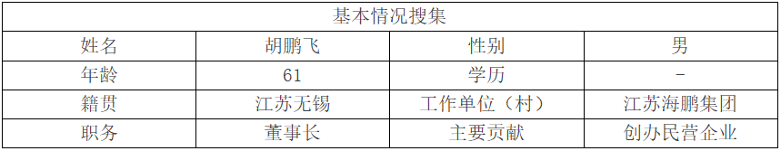
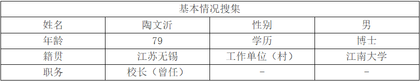
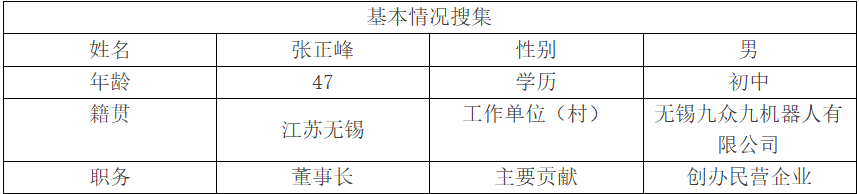
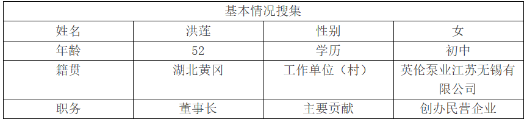

# 无锡

访谈记录

## 江苏海鹏集团胡鹏飞

**李朔源（采访人）**：四千四万正当时，大家好，我是李朔源，今天我们来到了江苏海鹏集团公司总部，公司历年来荣获众多荣誉，董事长胡鹏飞被授予“江苏省青年创业风云人物”、“无锡市青年创业先进”、“无锡市十佳青年企业家”等荣誉称号。今天呢，我们就邀请到了胡总，来到了我们的现场。胡总您好，我们是南京师范大学马克思主义学院的调研团队，现在正在进行一项有关民营企业家以及“四千四万”精神的认知、实践以及传承发展的调查研究，希望您能抽出一点时间配合我们做一个简短的访谈。

**胡鹏飞（受访人）**：好的。

**李朔源**：那么第一个问题呢，我们首先要请问您之前是否听说过“四千四万”精神，在您的创业过程中，有没有体现这个精神呢？

**胡鹏飞**：听说过，“四千四万”精神诞生于80年代的江浙，刚好契合了我成长的年代，因为当我出道的时候，已经是在90年代，90年代的企业家呢，也确实继承了这个“四千四万”精神。在20多年的创业经历里，包括到现在我们一直在弘扬这个“四千四万”精神。从我家电修理的创业开始，一直到家电的买卖，摩托车的经营，汽车的经营，到现在的整个企业经营集团，一直在秉持着这个“四千四万”精神。

**李朔源**：好，接下来呢，想请您与我们分享一下您的创业历程，您可以简单介绍一下您的创业初衷吗？您当时是如何“踏尽千山万水”，找到并抓住商机的呢？ 

**胡鹏飞**：从某一方面来说，就是生活的压力迫使我们去创业。但是我们的创业也得益于中国的改革开放，得益于中国经济的快速发展，我们踏上了上一个发展的快车道。我本人是学机械的，我弟弟是学习家电修理。所以我们一开始就是两个人的组合，从家电的修理开始迈上了人生重要的一步。在修理的过程当中，逐渐找到了发展道路。我从1993年开始跟机械公司合作，做了摩托车。随着老百姓的生活水平的增长，到2000年，我们又成立了汽车贸易公司。所以这是一条随着改革开放老百姓生活的富裕，我们一步步走向了老百姓消费的领域，然后走向了这条创业的道路。

**李朔源**：创业绝非易事，您是如何吃尽千辛万苦，带领企业攻克了一个又一个难关的呢？

**胡鹏飞**：怎么说呢？很多人说创业很难。我想说的是，一个行业里，一万个人在想，但是干的人很少，创业的人更少。那么作为我们来说，有梦想你就去干，不管失败也好，成功也好，你都有很宝贵的经验，只有干才能成功。所以，你说在这个过程当中，你说我有没有遇到问题？肯定有问题。比如说像我在医药行业，当有一天我的医药老总向我辞职的时候，我不知所措。我不知道这个公司是该卖掉还是可以继续经营下去。这时候我就学习毛主席的话，从群众中来，到群众中去，充分发挥群众的意见，后来我选择了一个很年轻的总经理。这个总经理从没有当过总经理，就是一般的中层干部。我火线提拔他，帮助医药公司闯过了这个难关，甚至做得比原来更好。

**李朔源**：好的，面对激烈的市场竞争，您是如何说尽千言万语，历尽千难万险，闯出一片天地，并且站稳脚跟的呢？

**胡鹏飞**：从海鹏这个集团来说，就是一直以客户为中心，注重人才培育培和持续创新，这是我们的价值观，也是契合了“四千四万”精神的。每一个行业，它在发展过程当中，一定是有一个高速发展期，然后一定有一个风险出现。任何事物都是有变化的，我们要辩证地看问题。从我们汽车来说，我们遇到过资金的问题、库存的压力、价格战等。随着我们新能源的发展，时隔几年，当人家认为汽车产业无法进行下去的时候，我们反向投资一点五亿，这个变化就导致了我们集团现在修订了未来的五年计划，我们未来的五年要由现在的50家门店变成100家门店，并且进入中国汽车50强。另外一方面，我们要迎接新的思维。大家都知道我们现在所有的媒体中就是手机占比很大，我们的数字化营销占了整个销售份额的4%，所以我们也需要不断地学习。

**李朔源**：好的，您是我们的前辈和榜样，借这个机会呢，想请您给我们广大的青年朋友提一些建议，尤其是您认为“四千四万”精神对于年轻一代的企业家和创业者有什么启示和价值吗？

**胡鹏飞**：我认为给青年朋友们有个建议吧，我想我们应该去学不畏艰难的拼搏精神，创业过程不会一帆风顺，要做好面对各种困难和挫折的准备，以顽强和不屈的精神去拼搏，不能因为一时的困难而放弃。然后是积极主动的开拓精神，要主动走出舒适区，到更广阔的天地去探索发现和成长。还有坚持不懈的沟通精神，在创业中，与各方的沟通至关重要，要通过良好的沟通来赢得支持、合作与发展。还需要勇于创新的探索精神，遇到问题时，要积极思考探索，用创新的思维去解决问题，开辟新的发展道路。

**李朔源**：非常感谢您的配合和支持，我们希望通过这次访谈能够更深入地了解民营企业家及“四千四万”精神的认知、实践现状，为提出“四千四万”精神的传承发展路径提供参考。再次感谢您的参与！
## 江南大学陶文沂

**周好（采访人）**：陶校长您好，我们是南京师范大学马克思主义学院的学生，我们今天来向您做一个采访。我们现在正在进行一项有关“四千四万”精神认知、实践以及传承、发展的调查研究，希望您能抽出时间配合我们做一个简短的访谈，谢谢！请问您之前是否听说过“四千四万”精神？您认为它在无锡乡镇企业发展历程中的文化象征意义是什么？

**陶文沂（受访人）**：我很早就听说过“四千四万”精神，虽然我没有亲身经历过，但我是对此有比较深入的了解的。我们国家原来的农业人口数量很大，虽然我们农村的工作是有积极性的，但是往往是在农忙季节很忙，农闲季节却很闲，而农民如果就靠农忙期间的那些农业主业，他们的生活质量是不可能非常高的。所以在很早的时候，农民就出现了这样一种情况：除了主业以外，谁都想富一点，那么他们就会出去打个短工，当个临时工，或者在家里面养点鸡、养点鸭、养点猪之类的，但是这样会受到很多阻碍。所以反过来讲，农民在那种情况下，他们的生活是相当的苦的。解放之后，农民已经是平等了，但是他们的生活条件还是比较差的，而“四千四万”精神是在改革开放以后，因为我们国家、我们党中央看到了农民问题是一个很大的问题，怎么样才能够把农民的这种潜力、这种积极性发挥出来，对国家的整个经济发展，对真正使得人民成为国家的主人，这是非常重要的。实际上，在十一届三中全会之前，我们也有一些小的乡镇企业，只是发展得比较慢，但是在三中全会之后，改革开放之后，当中央明确了这么一个态度以后，那么乡镇企业的发展就如雨后春笋一样，发展得相当快。帮农民提高他们的积极性，或者说很好地发展了他们在农业生产上没有充分利用起来的这种能力，所以建设了更多的乡镇企业。实际上乡镇企业一开始是跟农业相关的，或者跟农产品加工相关的，比方说，无锡乡镇企业最早就是造船，为什么要造船？因为农村的运输业，当年不像现在，当年的水路运输成本比较低，造船能够加速运输。所谓要想富先造路，那么先是有船运，第一个就是把造船厂建起来。那么“四千四万”精神，现在讲起来是乡镇企业的一种创业精神。其实最早的时候是说，这些乡镇企业的产品出来以后，销路在哪里？那就要靠销售员、推销员出去宣传。我们来看看“四千四万”精神是什么？踏遍千山万水，吃尽千辛万苦，说尽千言万语，经历千难万险，这4句话你看一听就不是在讲工厂生产，而是推销员。当然了，企业家也需要自己出去开拓市场，但是更多的这些销售员出去，你生产的产品怎么样才能够使得消费者接受？因为农村的产品，顾客可能不放心，那就要让他试用，试用以后满意，市场才能打开。所以“四千四万”精神是对乡镇企业发展的一个非常重要的支撑。1979年底总结评比的时候，总结出了“四千四万”精神。所以我们首先知道这“四千四万”精神是怎么来的。其实现在整个社会形势跟当年那个时候完全不一样，应该说是非常好的事，大家能够发挥自己能力的时候，但是因为这几年疫情受了一定影响，尤其是俄欧战争以后，西方对中国经济上的一些限制，那么可能大学毕业生在就业的时候，大家会感觉到一些事，一些发展变化，这个时候要了解一下“四千四万”精神，我觉得很重要。

**周好**：从您的观察来看，“四千四万”精神在无锡乡镇企业发展初期发挥了什么作用？

**陶文沂**：刚才我讲到造船厂，其实除了这个以外，有很多很强的企业。比方现在咱们无锡这儿的红豆企业。它实际上最早是1957年在岗厦建立了一个岗厦针织厂。一直到改革开放之后，1984年注册了红豆商标，然后到了01年的时候，成立了股份有限公司，02年的时候在上海、在美国建大厦，所以红豆这个企业，实际上应该是一个乡镇企业的典型的代表。当时有一个情况是比较普遍的，做得比较好的就是星期日工程师，为什么？比方说无锡，尽管无锡在苏南地区属于经济发展比较好的地带，但是无锡的工业跟上海的工业比，还是有一定差距的，星期日工程师很多都是从上海的一些大厂出来的，当然也包括无锡的一些厂。这些工程师利用周末时间，星期天到乡镇企业帮他们出主意，可能有些人就很担心，很反对，但其实他们来扶持乡镇企业、来提高产品质量，这一点绝对没有错。所以对这些乡镇企业的发展，包括乡镇企业家，这些四千四万的带头人，当然这里面也不乏一些原来的乡镇干部，他们还是作为企业的带头人，包括还有一些国有企业的有经验的工程师，来支持他们，帮他们把这个企业搞上去。后来高校的教师也能为企业很好地服务，那么能把这些企业的产品能够达到国内品牌，甚至于国际一流品牌，像红豆是国际专用品牌，他们后来的整个发展态势都很好，可以说是乡镇企业的代表。实际上我认为包括外地的工程师，包括高校的老师，也是受这种“四千四万”精神的感动。因为实事求是讲，农民一开始到企业的时候真的不容易。我曾经在无锡阳山那边一个氨基酸厂、味精厂，带着学生实习，我就深刻地感受到他们要生产的迫切性，因为从零起步要进行发酵，要生产，要拿出产品，要进入市场，开拓和培训。但是我可以给你举个例子，我有一个很熟悉的厂，这个厂就生产氨基酸，我可以讲跟你讲一下乡镇企业经过这么多年以后走到一个什么样的程度，这个企业一开始很不容易，我去的次数不少，比方说我们国内的氨基酸工业，因为这是我的专业了，氨基酸工业60年代的时候，日本是首屈一指，我们只有生产一个谷氨酸。那么到70年代我读研究生的时候，我的导师就给我提出来一个课题，要做赖氨酸的菌种，当时所做的菌种也达到了国内最高水平。无锡这家企业一开始我们也一直支持，包括我的学弟，我的学生，在那里担任总工程师，在菌种上面工艺上面，我们也帮助他，但是国际竞争就是很尖锐的。厂长就跟我讲，他们一旦某个氨基酸生产达到标准了，日本就把它出口到中国来的这种氨基酸价格压低很多，为什么？其实国外进来的产品它利润空间相当大，它往下一压，压力矛盾是什么？不至于把你压死，我们这边就顶住，我不给你压垮，继续生产，然后我们国内市场就逐步拓展。经过这么多年，从改革开放到现在，40多年过去50年了，他这个企业现在是在国际上超过了日本，超过了日本的两家公司，这就是我们的乡镇企业。
前两年中央台有一个报道，就是说我们的乡镇企业占国民经济的总额度要占到百分之七八十，在苏南地区，我不知道这个数字到底统计怎么样，但是我相信乡镇企业占的份额相当大，但后来有很多民营企业跟原来乡镇企业有一点区别，乡镇企业确切定位应该是在乡镇办起来，民营企业的话可以在乡镇也可以在城市，现在城市也拓展了，所以这个中间很难区分，但是由于乡镇企业发展，后来民营企业发展，应该说对我们国家的经济发展起到推动带动作用非常大。
现在像无锡，有很多在国际上处于比较能够讲得上话的地位的，或者产品在国外市场能够打开的企业。虽然都是民营企业，或许有相当一部分都是从乡镇企业发展上来。所以乡镇企业的发展，我认为对我们国家的经济的带动作用起了非常大的作用。 我们现在大学生数量很多，我认为大学生很多事情必须要向农民企业家们学习。企业家他们也在不断提高他们的文化素养，也提高他们的技术水平。现在有很多企业家是留学回来的博士搞的，比方我认识一位企业家生产的是发动机的叶片，叶片很小，就那么小小的一个叶片，价格非常高，叶片不是用在普通的上面，有些可能就用到军事上了。因为以前都是国有经济，不允许民营经济，但是乡镇企业起来以后，改革开放使得农民不再受到原来的约束了，他们把他们充沛的精力能够发挥出来，能够创造更多的财富，使得人们的观念发生了变化，对整个经济发展的推动起了很大的作用，这个是非常重要的。我认为乡村乡镇企业它起的作用不仅仅是乡镇，而是带动了我们国家的经济体制的一种变革，这个是非常重要的，

**周好**：您认为“四千四万”精神在乡镇企业发展不同阶段是否体现与时俱进的特点？

**陶文沂**：如果说一开始“四千四万”是推销员，实际“四千四万”是一个精神，是一种拼搏精神，一种不断向上的精神。所以讲“四千四万”是朗朗上口，实际上体现了中华民族要复兴的这样一种精神，你再有困难也要像万里长征一样，就是要拼搏向前，“四千四万”就是这么一个精神，所以不能把它限制在乡镇企业，而是一种中华民族寻求复兴之路的这样一种精神。
我们要经济上现在进到全世界第二大经济体了，实际上人均的话还是有很大差距，所以在这种情况下还是要强调四千四万精神。所以刚才提到这句话，大学生绝对要学习四千四万精神，大学毕业以后要刻苦的磨炼，不要怕。当年我大学毕业以后是在水电部下面的一个水电站修水电站，那是很辛苦的，干的活重体力劳动，我的口粮标准是56斤，一天要吃两斤粮食，我们现在水电站我知道他合龙坝修水电站必须要合拢，合拢是非常紧张的，三峡电站能合拢多少汽车来往，水要截住，那是非常紧张的，年轻人一定要刻苦，一定要敢于拼搏，所以这种精神是我们整个民族精神的一种代表。当时讲要把国民经济搞上去，对于工人农民整个社会，要让人民生活要幸福起来，必须要发挥大家的这种积极性。它的内涵是更加深刻的，然后它也是我们民族精神谱系一直同根同源，我们中华民族要在世界民族之林要站起来，不被外界的围困所压倒的话，要现在我们这一代年轻人发挥思想政治精神，我认为是这样。

**周好**：您认为无锡应该如何利用“四千四万”精神这一文化符号，助力乡村振兴或新兴产业发展？

**陶文沂**：企业发展对于无锡来讲是非常关键的。尽管无锡一直讲是人均GDP是全国最高的城市，但这话也很紧张的，毕竟无锡的跟苏州有区别，因为你讲去无锡，无锡跟苏州有个区别，苏州离上海比较近，上海起到一个辐射效应，那么辐射半径越远，受到辐射就越小，常州就更远一点，镇江更远一点，要到合肥的话那就很远了，所以无锡怎么样定位好，怎么样能够跟上海之间的这种通道能够加好，然后以后发展的企业往哪个方面走，定位必须定位好要支持。所以从我们学校来讲，因为我们学校原来的强势专业跟食品跟机械跟纺织紧密相关，现在实际上我们更重视的是什么？智能制造、信息产业、机器人，为什么？因为这是无锡现在企业发展就不需要的。我们必须要很好地开展科研，培养能够适应地方经济的这些人才。南师大我相信也会针对地方经济需要来培养相关的人才，所以无锡的从经济在转向这一点来讲，符合“四千四万”精神，它是在解决我们国家所急需的这些产业。
文化交流中心马上就要建起来，这里边有很多为地方经济作出贡献的，比方周海江就在这里面，红豆企业什么在疫情期间做出的贡献很大，疫情期间他们马上就转产生产防护服口罩，当时国务院联防联控物资保障组，来信赞赏红豆是当之无愧的抗击疫情军工厂，红豆在西哈努克港建的港口搞这个产业搞得非常好，就是说在那个地方工作三个月收入就要能赚一头牛，提供了几万个就业岗位，而且对于我们国家的“一带一路”，这是一个非常有力的支撑。国家的“一带一路”很多就是这些乡镇企业在支撑着把它搞起来。乡镇企业已经走出国门，不是原来的乡镇企业了，成就国家、中央的这样一个非常宏伟的大业，乡镇企业在这里发挥了巨大的作用。

**周好**：您认为如何更好地在青年群体中传承和弘扬“四千四万”精神？

**陶文沂**：乡镇企业刚刚起步的时候，农村的生活老百姓农民的生活水平还是相当低的，实事求是讲就靠农业那点收入不可能富裕的。农民是很辛苦的。那么经过几十年改革开放，现在整个生活水平提高了很多，简单是一句话吗？以前我们大学毕业了，分配工作到一个企业，给你安排个房子住着，有条件的话成家了还给你安排一套房子，比方说大学里面大学也得给你安排一套房子住，现在都是去买房。现在年轻人就感觉到现在我生活不幸福，大学毕业出来工资拿这点，买房买不起，买汽车买不起，结婚结不起，生孩子养不起。以前有这种情况吗？以前没有说要自己买，也没有要那么多汽车。有公交很好，有地铁很好。现在地铁修了那么多，所以年轻人要知道幸福生活是拼出来的，幸福是干出来的。总书记讲的话，不要觉得老一辈多好，比方说看着我们退休了，你们国家给你们一个月多少钱，他羡慕得很。不知道我们当年是怎么干出来的，我年轻的时候我跟你讲了，我定量是56斤，我们干活干的那是拼的56斤定量。干的什么工作，我们电杆要从山下抬到山上，现在汽车拉的，我们那时候抬上去，6个人抬一根电杆，绳子是那样绕的，所以6个人必须挺住抬上去，哪怕抬到中间，大家说停下来休息一下，抬上去以后要挖坑，把电线杆要栽起来，把它固定好，然后电线要拉好。我1968年底毕业，70年的元旦是在电线杆上过的，后来到工厂里面工作也是跟工人在一起，所以大学毕业生年轻人不要想着老一辈很轻松，我们就轻松了，因为尤其是独生子女，从小父母都比较宠爱，或者从某个地方来讲有点娇惯，但是必须知道老一辈创业的不容易，咱们就不说当年红军长征的，不说战争年代打那些仗把日本鬼子赶出去，把国民党这种腐朽统治推翻能够人民当家作主，这个时候牺牲的人多少？所以现在年轻人绝对不要想着幸福从天上掉下来。现在作为中国要民族复兴，总书记不是已经提出来了，到2049年就是新中国成立100周年的时候，应该达到一个目标，达到这个目标不是那么简单的。你前面达到这个脱贫已经非常不简单，但是有些地方返贫，还得要不断地努力拼搏，把事情做好，所以年轻人必须很好地懂得“四千四万”是一个什么样的精神。
当年老一辈是怎么创业，就像你父母亲，你父母亲已经跟“四千四万”差不多一段时间了，是世纪之交的时候毕业的，80年代90年代刚刚改革开放的时候，那些创业的真的不容易，我刚才讲的我们那时候真的出去要学点技术要干的话很不容易的，吃水不忘挖井人，这句话可以这么说，但是更重要的就是，不要忘了我们现在的幸福生活是怎么来的，是拼搏来的，对不对？就总书记讲幸福是靠干出来的这么个事情，不是自找苦，是要吃得了苦，对不对？当你们走上社会以后要跑哪个地方，要想做成一件事儿，你没有决心，没有毅力，没有钢铁意志做不好，不是那么简单的。你以为我们大学要建好校园那么容易吗？现在看到你看南师大校园很漂亮，当年老一辈的校级领导花了多少心血在上面？年轻人要知道创业之艰辛，要有吃苦的思想准备，年轻的时候如果不吃苦不拼搏，到后边会后悔。

**周好**：当前经济社会环境与改革开放初期有很大不同，您认为在新的历史条件下，“四千四万”精神对年轻一代的企业家或创业者有何启示？

**陶文沂**：对。我很想对这个事情谈一点我的感受，如果说当年的“四千四万”精神是简单的吃苦，如果当时只是要有一个吃苦精神，那么现在不仅是吃得了普通的苦，而且要能吃得了学习知识，掌握本领这种苦。大学生因为我跟他们有些老师接触，我问现在大学生怎么样，他们跟我讲叫喜忧参半，因为现在大学生接触的面很广，知识来源也很多，信息来源也很多，思想也很开放，然后对学习，也就是说有些课程他就不想认真学了，但是问题就是如果我们国家要强大，要在国际竞争中，尤其是美国和欧洲，西方要想压制我们这种情况下，我们能够挺得住，我们必须把先进技术掌握起来。对大学生来讲，各自有自己的专业，你要把这个专业知识要搞到尖端上去，所以我跟我们自己专业的学生，他们大学一年级进来，我就跟他们讲，你在学习课程之外，对于你这个专业国际跟国内是什么状态，必须要了解国内跟国际上到底有多大的差距。差距谁来把它缩小，谁来把它去掉？它就得靠年轻一代。哪方面你要赶快往上攻的，你就自己定个方向，攻上去。大学生责任很重，担子很重，不要觉得我就上课就行。当然还有一些可能还没有读好的，还有光读好还不够，要自己把握4年时间。我要向哪个方面往前冲、拓展的，希望能够在读硕士读博士阶段能够到国际上尖端上去，才是你真正体现“四千四万”精神。所以不光是简单吃苦，而要在科学科技上面攀登高峰。
老一辈的我刚才讲到我搞的赖氨酸菌种，毕竟菌种最后能够卖到法国去，那是在国际上处于领先。要是在我们国家生产的，现在在无锡厂生产的能够压住日本了，那就走到尖端去，还有很多，所以我觉得大学的老师，大学的学生，大学毕业生，你是干这一行的，就得把这一行做到尖端上去，就是我刚才讲的顶天立地要顶天去，要立即解决实际问题，把我们国家的经济真正发展上去。
## 无锡九众九机器人张正峰

**施弘博（采访人）**：张总您好，我们是南京师范大学马克思主义学院的调研团队，现在正在进行一项有关“四千四万”精神的认知、实践及其传承发展的调查研究，希望您能抽出一点时间给我们做一个简短的访谈。“四千四万”精神的含义是踏尽千山万水，吃尽千辛万苦，说尽千言万语，历尽千难万险，体现了江苏乡镇企业创业者敢为人先、拼搏进取的时代风貌。首先，想请问您之前是否听说过“四千四万”精神？

**张正峰（受访人）**：听说过很多次。

**施弘博**：在您的创业过程中是否体现了这一种精神？

**张正峰**：体现得淋漓尽致。

**施弘博**：好的，那接下来想请您与我们分享一下您的创业历程。您可以简单介绍一下您的创业初衷，以及您是如何踏尽千山万水找到并抓住商机的。

**张正峰**：我先说一下怎么叫踏尽千山万水。我老家在河南，我93年从河南到无锡，要经过两段路程。第一段路程是从河南坐大巴车到南京。93年这个路段怎么走的？先走312国道坐大巴车，到了南京之后又坐火车。当时我还是15岁的孩子，也就是初中毕业的时候。当时到无锡来也不知道要做什么，但是我知道大城市是好的，非常向往上海，我的目的地就是上海。但是因为没钱，所以先到南京再去上海。我从家里带了40块钱，我们两个人从河南到了南京花了17块钱。车票8.5元一张，还剩23元。那个时候大巴车上的小偷很多，身上的二十块钱早上只剩了三块钱。后来我们就想办法——站台票。你这个年龄段有没有听过什么叫站台票？站台票就是一块钱一张，从南京就可以上火车。但是我们也没有钱，所以只能先坐上火车再说。后来坐的火车一路被查票，查到了无锡，我们就从无锡下车。下车还不能走火车道的正门，我们就从现在的火车站往东走，有个铁路岔口走出去就到了无锡。所以就和无锡结缘了，之后30年再也没离开无锡。我在无锡的第一份工作就是在一个模具厂做钢材的搬运工，然后就跟模具结缘了，我就喜欢上了这份工作，也是做了一辈子的工作。我现在做的车间的模具厂就是源自于93年那一次工作。我希望你们未来找到一份自己喜欢的工作，用你的爱好去工作。或者说，既然选择了就不要轻易去换，因为所有的坚持都是需要付出代价的。所以当你一路走过来之后，你会发现一路都是风景。

**施弘博**：好的，感谢您与我们分享您的创业历程。创业绝非易事，面对激烈的市场竞争，您是如何说尽千言万语、历尽千难万险，闯出一片天地并站稳脚的？您可以跟我们讲一下企业的发展历史。

**张正峰**：我创业很早，明年应该是我创业30周年。我是96年的11月创业，在那个时候创业不需要高大上的东西。我喜欢我自己做的工作，所以我做任何事情都不感觉到累，不管走多远。可能你们现在还没有感觉，以前我创业的时候，无锡所有的路都用自行车测量过。我骑着自行车可以向南到宜兴、到江阴。那个时候年纪也轻，也不怕苦，就感觉每天都很兴奋。

**施弘博**：您为了创业、为了去寻找客户，用自行车就是丈量了无锡的差不多每一条道路。您是我们的前辈和榜样，借这个机会想请您给我们广大青年朋友一些希望和建议，尤其是您认为“四千四万”精神，对于下一代，比如说我们这一代企业家和创业者有什么启示和价值？

**张正峰**：“四千四万”精神是一种企业家精神。我想跟你们说的是，传统的道路是先拥有，然后去做，最后成功。我现在更要给你们说的是，你要去想——我是什么样的人，然后我要成什么样的人。什么意思？就是我的心有多大，我的梦想有多大，我就按照这个梦想去做。而不是说我先成为了再去做，这是两条不同的路。在创业的时候首先要有梦想。所以我希望你们毕业了之后，首先要想到三十年以后我是什么样的人，我要做什么事，然后按这个路径的规划来做事情。

**施弘博**：您希望我们青年朋友要有一个长远的目标，想到自己未来要成为一个什么样的人，并为之努力奋斗。

**张正峰**：对。当你有这个长远的目标的时候，你路上的所有的折磨都是风景。当你没有目标的时候，一点点挫折都是磨难。同样是一个很远的目标，我心之向往，我就会想尽一切办法去努力，在这个中间所有的磨难都是风景。

**施弘博**：张总我知道您本人是我们区的政协委员，而且我们九众九机器人公司是在无锡机器人与人工智能制造协会中的，您可以谈谈您作为一名企业家对社会发展做出的贡献。

**张正峰**：首先作为一个政协委员，我们主要是建言献策，做好履职担当。作为一个企业，我觉得最重要的是带着我们的员工达到最好的工作状态，就是越来越喜欢这种工作，让大家在我们九众九感到骄傲。第三个事情就是人工智能的大时代被你们赶上了，未来的AI智能是在一个万亿级的市场。第四次革命是从AI开始的，所以希望你们抓住这个AI的大时代。我们说2024年是人工智能的元年，期待你们都投入到AI的大环境当中，拥抱人工智能。

**施弘博**：好的，谢谢张总。非常感谢您的配合和支持，我们希望通过此次访谈能够更深入的了解民营企业家及“四千四万”精神的认知、实践现状，为提出“四千四万”精神的传承和发展路径提供参考，再次感谢您的参与，谢谢。

## 英伦泵业江苏无锡有限公司洪莲

**施弘博（采访人）**：洪总您好，我们是南京师范大学马克思主义学院的调研团队，目前正在开展一项关于“四千四万”精神的认知、实践以及传承发展的调查研究。希望您能抽出一些时间，配合我们进行一个简短的访谈，谢谢！“四千四万”精神的含义是踏尽千山万水，吃尽千辛万苦，说尽千言万语，历尽千难万险，体现了江苏乡镇企业创业者敢为人先，拼搏进取的时代风貌。那么第一个问题，请问您之前是否听说过“四千四万”精神，在您的创业过程中有没有体现这种精神？

**洪莲（受访人）**：听说并且体现过。

**施弘博**：好的。能否请您分享一下您的创业历程并简单介绍一下创业初衷呢？

**洪莲**：我来自湖北省黄冈市黄梅县，1993年来到无锡。最初，我的创业初衷就是在无锡站稳脚跟，然而这个过程充满了艰辛与坎坷。那时，我的家境并不宽裕，学历也不高，可以说是白手起家。1993年一毕业，我就来到了江苏无锡，同年4月12日进入无锡纺织厂第六分厂工作。到了9月份的时候，凭借着加倍的努力，别人每天工作8小时，我工作16小时，就这样一路奋斗，我成为了当时纺织厂里唯一的一个外包公司领导人。在纺织厂里工作5年后，我萌生出了自己创业的想法。当时我们经济十分拮据，租住在房子里，甚至连买米的钱都没有。我和我先生一起找朋友借了些钱，于1998年开启创业之路。创业初期的两年非常艰难，直到2000年，我们接到第一单生意，赚了1万多元，这让我们看到了希望。我们之前的企业是从事纺织电子仪器的，在九几年到两千年，纺织行业整体的发展态势都非常良好，企业生意都很好做。2001、2002年，我的企业是飞速发展的，作为私人企业，利润也较为可观。但到了2003年，企业发展遭遇了瓶颈期，产品出现问题。为了解决技术难题，我们多次前往上海诚邀技术员，尽管过程艰难，技术员起初并不愿意来到无锡，但我们凭借十足的诚意，最终还是成功邀请到了技术人员，生意又好起来了。2008年金融危机爆发，各个行业都遭受重创，我们也未能幸免。同时呢，纺织行业也有好多新的产品慢慢涌现，像我们原来传统的电子行业面临淘汰，于是我们也就慢慢地缩减了这一块的业务。2010年，有了一定的积蓄后，我尝试开了一个饭店。但经营了一年后，我意识到这真的不适合我。2011年，有了一个很好的机会。当时无锡市有两个水泵厂，我们原来的厂就在其中一个水泵厂旁边。这个水泵厂是集体企业，都是村民在里面上班，居委会书记看中了我们的创业精神，询问我们能不能把水泵厂接下。这意味着跨行经营，我们对水泵行业一无所知，还要承担五六十名员工的生计。但我们还是决定抓住这个机会，将所有的积蓄包括当时的几套房子全部做了一个抵押，接手了水泵厂。接手后，我给员工大幅涨薪，从原来的1000多块钱，我会给他加到4000多5000多，但是我对他们也有要求，一个人要承担多个人的工作。刚开始的时候，我们什么工作都不懂，我家先生他就搞业务，我负责后勤工作，包括采购、员工管理等等，天天带着我们的工人去给人家修坝、采购，那个时候我们也没有请司机，都是我自己来开车。16年的时候，我们又摔了一个大大的跟头，由于技术落后，产品出现质量问题。原来我们认为只要沿用老产品的模式就可以了，却忽略了技术更新的重要性。问题出在电机上，不是我们的水泵，是我们的电机没有配置好。发现这个问题后，我认为我们一定要请到一个高级职称应用工程师。17年、18年的时候，我们就在挖一些外面的像外资企业的优质技术员，组建技术团队。在他们的帮助下，我们对原来的产品进行更新优化，还不断地开发新产品。近年来，我的技术总监给了我极大的底气，我的产品好，我的技术好，我的服务好，这是他给我最大的底气，让企业在疫情期间也能稳步发展。如今，我们的水泵产品致力于节能降耗，为社会贡献力量。在节能成为发展标准的当下，我们为千家万户降低能耗，还与众多代理商开展科技共建合作。从2017年到至今的这七八年，创业之路非常艰难。之前很多原来的客户都会给我打电话，说你们质量不好，还有就是资金的亏损，让我几次都想放弃。但技术总监始终给予我支持，他不仅专注技术研发，还经常到外面讲课分享经验。我自己也积极了解市场动态，参加上海国际展等展会，利用百度、抖音、微信视频等推广产品。不走出去的话，人家也不会知道有这样的产品。再者呢，我的儿子也给了我很大的底气，他高中毕业后去当兵，退伍后进入大学，每年都获得国家奖学金，还考上了华中科技大学读研，并且成为选调生。这些都激励着我坚持下去，也让我坚信，做任何事都要持之以恒，半途而废必将一事无成。这一路走来，“四千四万”精神始终贯穿其中，激励我克服重重困难。

**施弘博**：您在创业的初期是非常艰苦的，独在他乡为异客，为在无锡扎根花费了很多的心血，在创业过程中也历经多次的转型，还体现了集体企业和民营企业的并购、转型、合资，在并购的同时还保障了手底下很多员工的就业以及他们的生活水平，并且我们的水泵厂历经千辛万苦，找到了很多的技术人员，发挥了我们产品的竞争力，在如此激烈的市场竞争中站稳脚跟，闯出一片天地。您是我们的前辈和榜样，借这个机会也想请您给我们广大青年朋友提一些希望和建议，尤其是您认为“四千四万”精神对青年一代的企业家创业者有什么价值和启示？

**洪莲**：我认为对于年轻人来讲，创业不能盲目，在行动之前，要不断学习，了解市场需求是什么，明确你的目标是什么。我现在经常招聘年轻人，发现他们的想法跟我们的想法有点不一样，他们的思路非常宽阔。我也希望年轻人在制造业这个行业里面一定要扎根，不要怕吃苦。比如在制造业，有的年轻人不愿意在车间干基础工作，都想坐办公室，可如果没人做基础工作，企业又怎么才能实现发展？技术行业是市场稀缺的领域，年轻人既要有广阔的眼界，也要能扎下根去，吃苦耐劳，扎扎实实地掌握技术。中国制造业在全球名列前茅，发展前景非常广阔，像水泵行业，我一直说，有水的地方就必须要有水泵，有人的地方就必须要有水泵。希望年轻人能在制造业深耕，发扬“四千四万”精神，不怕困难，勇于拼搏，在这个大有可为的领域闯出自己的一片天地。

**施弘博**：非常感谢您的配合和支持！我们希望通过这次访谈，能够更深入的了解民营企业家及“四千四万”精神的认知实践现状，为提出“四千四万”精神的传承和发展路径提供参考。再次感谢您的参与！
的配合，我们青年大学生和企业家会有吃苦的精神和强大的信心，为“四千四万”精神的传承和发展贡献我们的青年力量。

## 江苏锦绣铝业有限公司	戴祖军
https://mp.weixin.qq.com/s/_SJEp1bd2Wz-IcHOJAHRdw

## 无锡小天鹅建筑机械有限公司	李石生
https://mp.weixin.qq.com/s/9hs2HmwINEqiCoSjeb0y4g

## 远景集团	张雷
https://mp.weixin.qq.com/s/tHKDo4IfmjBhos6HaGQ6Tw

## 江苏长电科技股份有限公司	王新潮
https://mp.weixin.qq.com/s/BEuMV1gCtZ65LG-p24cSPw

## 无锡雪浪数制科技有限公司	王峰
https://mp.weixin.qq.com/s/t9YmHx7xJCe_LKfZRFF90w

## 江阴长仪集团有限公司	陈建章
https://mp.weixin.qq.com/s/3KLaE0VP2VZPT-lwcyBXCA

## 双良集团	缪双大
https://mp.weixin.qq.com/s/PkQb8Y4pYSSTxNV93unLdA

## 江苏三联生物工程股份有限公司	施启尧
https://mp.weixin.qq.com/s/eUb8OUrfeTVZj1-tDgsFbA

## 上机数控	杨建良
https://mp.weixin.qq.com/s/0pKYkZpd_AKSfPkOkYTT4Q

## 江阴贝瑞森生化技术有限公司	顾铭
https://mp.weixin.qq.com/s/HCxr4XV6kNyzAj_O-dPJMQ

## 无锡市恒和环保科技有限公司	杨延相
https://mp.weixin.qq.com/s/pgKTVe0643hHBm8kOlXHbA

## 墨境天合无锡数字图像科技有限公司	徐建
https://mp.weixin.qq.com/s/I-kx5da5zyYdx4gJS27A4A

## 红豆集团	周海江
https://mp.weixin.qq.com/s/tRDPBfG-ZuH4-9LAqLhTIA

## 海澜之家	周立宸
https://mp.weixin.qq.com/s/He_PHaPNZcKJtbU42UVR_w

## 无锡明恒混合动力技术有限公司	洪波昌
https://mp.weixin.qq.com/s/RI-4iBUqlw2hzj9hzSfnbA

## 双良节能	缪文彬
https://mp.weixin.qq.com/s/fxZLiCSnahvxQR1Q8rRdPQ

## 长电科技	王新潮
https://mp.weixin.qq.com/s/pGMvX5EL4-jbZ1Pniu8Tiw

## 无锡微研股份有限公司	蔡磊明
https://mp.weixin.qq.com/s/2N2yk4o_mt7HseowvDmfsw

## 远景能源	张雷
https://mp.weixin.qq.com/s/wymVV8kWv_lVaFm2VUSmTw

## 无锡鼎邦	王仁良
https://mp.weixin.qq.com/s/R3Z3F34BFO8DzbYRYP2xmg

## 江阴模塑集团	曹克波
https://mp.weixin.qq.com/s/lbPtwdtzJD04BP0CyzgThg

## 海澜之家	周建平
https://mp.weixin.qq.com/s/hA7lGZne-1TqMNJ8IMLxoA

## 无锡晶晟科技股份有限公司	冯科杰
https://mp.weixin.qq.com/s/cSHjGjIsI6JcX332-k49fA

## 兴达泡塑	华若中
https://mp.weixin.qq.com/s/i4FItUkSvAtZZidKTz-bRg

## 无锡先导智能装备股份有限公司	王燕清
https://mp.weixin.qq.com/s/K-S6fXUevDwJJucLsO_KWg

## 申锡机械集团有限公司	吴仁山
https://mp.weixin.qq.com/s/DIXIDpzwb6SpkG92i2bAnA

## 无锡华光汽车部件集团	薄铸栋
https://mp.weixin.qq.com/s/vwCW0br7qWw7gm477CpLUQ

## 药明康德	李革
https://mp.weixin.qq.com/s/adUGRNMXnWevlD8uiLHZxA

## 江苏华宏实业集团有限公司	胡士勇
https://mp.weixin.qq.com/s/hpyHfdJ4Sa13KqrgSQmkeg

## 江苏华宏实业集团有限公司	胡品贤
https://mp.weixin.qq.com/s/hpyHfdJ4Sa13KqrgSQmkeg

## 红豆集团有限公司	周耀庭
https://mp.weixin.qq.com/s/7aKYqA_JqV2EdePa6zR1AQ

## 上能电气股份有限公司	吴强
https://mp.weixin.qq.com/s/6bUA02EzoPhEHwa4UetwCw

## 江阴天江药业有限公司	俞敏
https://mp.weixin.qq.com/s/OlrFvBo3OOj8xyqMMblL9g

## 无锡蠡湖增压技术股份有限公司	王洪其
https://mp.weixin.qq.com/s/274txhVLz41XfdybiAnnDQ

## 法尔胜泓昇集团	周江
https://mp.weixin.qq.com/s/NRZfPLvjuHLSoBkIj0iztg

## 华润微电子	李虹
https://mp.weixin.qq.com/s/9XaR8qkOGEg4eDOQbQGCWw

## 国合环境高端装备制造基地	邵焜琨
https://mp.weixin.qq.com/s/mCwwuG0P1vsqidrfy3nWPQ

## 恩纳基智能科技无锡有限公司	吴超
https://mp.weixin.qq.com/s/-PhpUzgpZBcgdogLYb4kgg

## 江苏泰源环保科技股份有限公司	陆纯 潘海龙
https://mp.weixin.qq.com/s/tf4LvsoE7LukroXX0iSSJQ

## 苏嘉耘林集团	龚育才
https://mp.weixin.qq.com/s/lMXF5m8K76cGUPtSyCpZVA

## 无锡百泰克生物技术有限公司	周志图
https://mp.weixin.qq.com/s/RtZYIPNvDAaX9XfX7GFXvw

## 海斯凯尔医学技术有限公司	邵金华
https://mp.weixin.qq.com/s/LzGC0ZVWJdYOj6780Sbfbw

## 江苏威腾体育产业股份有限公司	张妍
https://mp.weixin.qq.com/s/jvQkO1JBJwjBYTDVsQQBOA

## 中恒大耀纺织科技有限公司	朱建军
https://mp.weixin.qq.com/s/XiBIbgTNSXKYvkN2y93cRg

## 江苏飞慕生物科技有限公司	史春龙
https://mp.weixin.qq.com/s/kUs3xl8oleHHW_q7wuUwsg

## 无锡好轻松盲人推拿按摩有限公司	严三媛
https://mp.weixin.qq.com/s/NyTcWRgsststOfLXE0OGqw

## 百尔制冷（无锡）有限公司	胡国强
https://mp.weixin.qq.com/s/N92Kuqh6ztgMextTCZfZ0w

## 爱景智能（无锡）有限公司	孙云川
https://mp.weixin.qq.com/s/bacd_CgqirTnNOZfhdE_Ng

## 江苏无锡朝阳集团股份有限公司	张君君
https://mp.weixin.qq.com/s/-RR4Aud_1QXBXp_JL4CGCA

## 江苏才标信息科技有限公司	袁小琼
https://mp.weixin.qq.com/s/1MFbe22KGoz4FDjewETzzA

## 中粮工程科技股份有限公司	姚专
https://mp.weixin.qq.com/s/QMbjlVnBp6rhOh__csoqSg

## 无锡耐思生命科技股份有限公司	杨卫东
https://mp.weixin.qq.com/s/1pAwq7bpf-xCi7Oax_KmyA

## 无锡九方科技有限公司	周峥
https://mp.weixin.qq.com/s/GXqF_F9t0CkVfAQ0r70i9Q

## 江苏雅克科技股份有限公司	沈琦
https://mp.weixin.qq.com/s/i4v7LR_Ys4Fqi2sxFyjyMA

## 江苏阳光集团有限公司	陈丽芬
https://mp.weixin.qq.com/s/TpX4gJtUQBPHMmZm-kL3mg

## 江苏新日电动车股份有限公司	张崇舜
https://mp.weixin.qq.com/s/zd712KXKPFbLvwb7CikD4Q

## 凯龙高科技股份有限公司	臧志成
https://mp.weixin.qq.com/s/9XJeQPq6_ZWIJuAJ0VFHtA

## 华云数据控股集团	许广彬
https://mp.weixin.qq.com/s/7dCWC_Em47zYrdloJ18GkQ

## 朗新科技股份有限公司	张明平
https://mp.weixin.qq.com/s/hxyU3nxCyj-9q4h90qNkOA

## 祥生医疗	莫若理
https://mp.weixin.qq.com/s/mJ0zgzZ--D-__Vinc6AgUQ

## 晶众股份	庄斌
https://mp.weixin.qq.com/s/LhtOpwQnRwJ55FiMUWOkvg

## 无锡市玉祁酒业有限公司	姚永海
https://mp.weixin.qq.com/s/lthF3bI5Np_y2MIv9TdzNA

## 塬数科技	逄振
https://mp.weixin.qq.com/s/t6ZLvs0_P9bH-gjcKktjVw

## 无锡信捷电气有限公司	李新
https://mp.weixin.qq.com/s/KlfrIVSRYj_YNh0DinFu6A

## 臻和科技公司	杜波
https://mp.weixin.qq.com/s/crfx3OZwNnc5rCtGYjCCiA

## 无锡华光汽车部件科技股份有限公司	薄可晨
https://mp.weixin.qq.com/s/rVyzz6InBcxR_4fg_PoopA

## 中科海拓（无锡）科技有限公司	刘涛
https://mp.weixin.qq.com/s/WZcQZ3SYeZD8S3FSggrssQ

## 无锡帝科电子材料股份有限公司	史卫利
https://mp.weixin.qq.com/s/KG2JrZyPyyaIS8Rd5t_XxA

## 鹏鹞环保股份有限公司	王鹏鹞
https://mp.weixin.qq.com/s/iDFSVZPKHWFalbosdxhnIg

## 江南模塑科技股份有限公司	曹克波
https://mp.weixin.qq.com/s/s5ai0Nzv6hjHLlrB8NBKYA

## 无锡一棉纺织集团	周晔珺
https://mp.weixin.qq.com/s/nCIzAMW2F4joLqY0JkgjNQ
