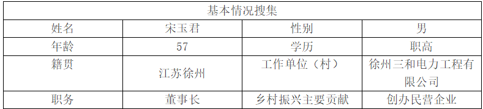
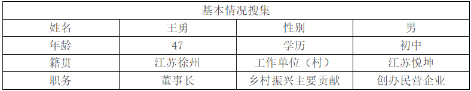
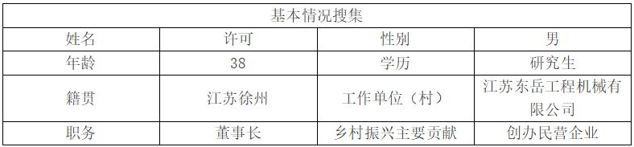
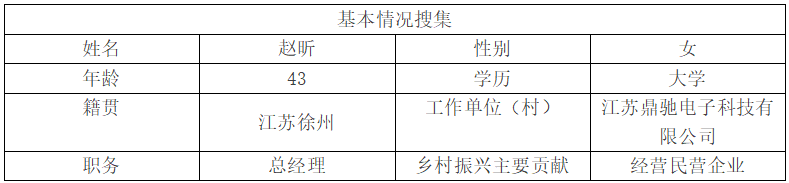

# 徐州

访谈记录

## 徐州三和电力工程有限公司宋玉君

**张文迪（采访人）**：您好，我们是南京师范大学马克思主义学院的调研团队，现在正在进行一项有关“四千四万”精神的认知、实践及其传承发展的调查研究，希望您能抽出一点时间给我们做一个简短的访谈。
“四千四万”精神的含义是踏尽千山万水，吃尽千辛万苦，说尽千言万语，历尽千难万险，体现了江苏乡镇企业创业者敢为人先、拼搏进取的时代风貌。第一个问题，您之前是否听说过“四千四万”精神？在您的创业过程中是否体现了这一种精神？

**宋玉君（受访人）**：第一，这个“四千四万”精神我是听说过的。第二，在我们创业过程中，确实经历了这么多。从最初决定创业的那一刻起，我就知道这会是一条充满艰辛的道路，而在实际的创业历程中，每一步都印证了“四千四万”精神所蕴含的那种拼搏与坚持。

**张文迪**：好的。那请您简单地跟我们分享一下您的整个创业历程。

**宋玉君**：企业创业它是一个极为复杂的过程。创业之初，面临的是一连串难题，企业的模式选择、运行方式的确定、人才的合理搭配、内部分配机制的构建等等，这些问题相互交织，每一个环节都至关重要，而解决这些问题的过程也是困难重重。特别是对于我们农民创办的企业来说，其中的艰辛和复杂更是难以言表。这整个艰苦的过程，实实在在地在“四千四万”的具体内涵中得到了体现。
另外，企业经营本身风险就非常大，刚开始创业的时候，我是把全部身家都投入进去维持企业运行，那种压力和责任，常人难以想象。我创业经历了这么几个重要阶段：第一就是生存期。这个阶段，虽然从某种程度上来说是创业的起步阶段，看似简单，但对于我而言，却充满了未知和挑战。资金来源、人员配备、产品方向、经营模式的选择等一系列问题，都是摆在面前的全新课题。每一个决策都至关重要，一旦失误，可能就会让企业陷入困境。
所以在这个阶段，必须要细致入微，慎重对待每一个选择，判断的方向要绝对正确。尤其是对市场的分析，一定要紧密贴合国家的发展大势，只有这样，企业才有可能在激烈的市场竞争中存活下来。比如说，在选择经营模式的时候，我参考了同行业的先进经验，结合自身实际情况，经过反复权衡和尝试，才确定了一套适合我们企业初期发展的模式。
在资金来源方面，我四处奔波，向亲朋好友借款，同时积极寻求银行贷款，经过无数次的沟通和努力，才勉强凑齐了启动资金。第二个阶段是发展期。简单来讲，就是要时刻关注政策和市场的变化，及时调整企业的发展方向，不断地更新下一个阶段的规划。
直到现在，我们其实还是处于发展期的阶段。在这个阶段，政策的导向和市场的需求就像指挥棒，我们必须紧紧跟上。例如，随着国家对清洁能源的重视和推广，我们敏锐地察觉到这是一个发展机遇，于是投入大量资源进行相关电力工程技术的研发和应用，成功开拓了新的业务领域，为企业的发展注入了新的活力。但这个过程并不轻松，需要不断地投入资金进行技术研发、人才培养，还要应对市场的变化和竞争对手的挑战。

**张文迪**：好的，那接下来想请您与我们分享一下您是如何选择这个行业的，您的创业初衷是什么？以及您在创业过程中是如何克服种种困难的？

**宋玉君**：选择这个行业是这样的。我原来是在国有企业上班的，工作就是搞这个方向的。在国有企业工作的那段时间，我积累了丰富的行业经验，也对这个行业有了深厚的感情。后来在国有企业改制之后，我面临着重新选择职业道路的难题。经过深思熟虑，我决定走上创业这条路，主要原因有两个。一个是我对原行业有着深厚的情感，希望能够继续服务这个行业，为行业的发展贡献自己的力量；另一个是我的专业是学习无线电，与电力有一定的相通之处，在技术方面有一定的基础，这让我有信心在这个领域闯出一片天地。
企业刚创办时，遇到的第一个难题就是人才引进。在这个科技飞速发展的时代，人才是企业发展的核心竞争力，没有人才素质的提高就没有产品的提升。为了吸引优秀的人才加入我们的企业，我可谓是费了大心力。我们企业地处乡镇，与大城市的企业相比，在薪资待遇、发展机会和生活环境等方面都不占优势。为了吸引人才，我一方面努力提高企业的薪资待遇，尽管初期企业资金紧张，但我还是咬咬牙，给出了相对有竞争力的薪酬；另一方面，我向每一位前来应聘的人才描绘企业的发展蓝图，让他们看到在我们企业的发展前景。我还积极为人才提供良好的工作环境和发展空间，鼓励他们创新和成长。
经过长时间的努力，才逐渐组建了一支专业素质过硬的团队，企业也得以不断发展。除了人才引进，业务竞争也是一个巨大的挑战，尤其是拿项目。那个时候，民企与国企、央企比起来，最大的劣势在于实力不足。在资金、技术、品牌影响力等方面，我们都难以与它们抗衡，所以业务竞争力不行，拿到的项目比较少，而且项目规模小，利润也很薄。
这对于刚成立的民企来讲，风险是非常大的。一旦项目出现问题，或者资金周转不畅，企业就可能面临生存危机。不仅如此，民企之间的竞争也异常激烈，市场就那么大，有的东西你不做，别人在做；有的东西你不改进，别人在改进。为了在残酷的市场竞争中打拼出属于自己的生存空间，我们只能不断提升自身的实力。我们加大技术研发投入，提高产品质量和服务水平，努力打造企业的核心竞争力。同时，积极拓展市场渠道，加强与客户的沟通和合作，通过优质的服务赢得客户的信任和口碑。

**张文迪**：您是我们的前辈和榜样，借这个机会想请您给我们广大青年朋友一些希望和建议，尤其是您认为“四千四万”精神，对于下一代，比如说我们这一代企业家和创业者有什么启示和价值？

**宋玉君**：我认为人真正的生存能力的提升主要体现在以下几个方面。第一，要做好充分准备。在这个快速发展的时代，能力方面一定要跟得上时代发展要求。这就需要不断学习新知识、新技能，提升自己的综合素质。无论是专业技术能力，还是管理能力、沟通能力等，都要不断地学习和锻炼。同时，一个人的三观要符合社会规范。只有树立正确的世界观、人生观和价值观，才能在创业的道路上走得正、走得稳。在创业过程中，会面临各种诱惑和挑战，如果没有正确的三观作为指引，很容易迷失方向。第二，要眼高，看的事业上要宽广，要有远大的目标和抱负。不能只满足于眼前的小成就，要有长远的规划和发展眼光。同时也要脚踏实地，不能好高骛远。远大的目标需要一步一个脚印去实现，每一个决策、每一个行动都要切实可行。在创业过程中，既要仰望星空，又要脚踏实地，把理想和现实结合起来。第三条就是如何判断是否能够创业。我建议大学毕业生最好是在企业当中先历练两次。
在企业工作的过程中，可以深入了解市场的运行规律，学习先进的管理经验和技术，积累人脉资源。等你成熟了，对市场的把握比较准确了，对模式的选择也做到了心里有数，这时我们的创业就有可能成功。毕竟创业生存期是一个漫长的过程，在这个过程中，要综合分析自己的责任，评估自己的能力。要清楚自己能够承担多大的风险，具备哪些优势和劣势，只有这样，才能在创业过程中有的放矢，提高成功的概率。

**张文迪**：好的。非常感谢您的配合和支持，我们希望通过此次访谈能够更深入地了解民营企业家及“四千四万”精神的认知、实践现状，为提出“四千四万”精神的传承和发展路径提供参考，再次感谢您的参与，谢谢。

## 江苏悦坤王勇

**张文迪（采访人）**：您好，我们是南京师范大学马克思主义学院的调研团队，现在正在进行一项有关“四千四万”精神的认知、实践及其传承发展的调查研究，希望您能抽出一点时间给我们做一个简短的访谈。“四千四万”精神的含义是踏尽千山万水，吃尽千辛万苦，说尽千言万语，历尽千难万险，体现了江苏乡镇企业创业者敢为人先、拼搏进取的时代风貌。您之前是否听说过“四千四万”精神？在您的创业过程中是否体现了这一种精神？
王勇（受访人）：听说过，也体现了。“四千四万”精神可不是一句空洞的口号，它实实在在地贯穿了我创业的每一步，是我一路走来的真实写照。

**张文迪**：那接下来请您与我们分享一下您的创业历程，以及您是如何历尽千辛万苦攻克创业难关的。

**王勇**：我们公司成立于2014年，主要致力于徐州传统文化美食——馓子的传承与发展，并且很荣幸成为了市级非遗传承对象。回想起创业之初，那真的是一段充满艰难险阻的日子。新产品进入市场，面临的困难远超想象。消费者对我们的产品并不了解，市场接受度极低，导致产品大量积压，销售业绩惨不忍睹。当时，工人只能上半天班，企业运营陷入了困境。但我深知，产品的品质是企业的生命线，所以我告诉工人们，只要把产品做好，把品质把控到位，产品卖不出去是我这个老板的责任。即便如此艰难，我们依然给上半天班的工人开全天工资，就是为了让员工安心工作，没有后顾之忧，让他们能全身心地投入到产品制作中。
到了2014年下半年，为了改变企业的困境，我决定主动出击，亲自带领团队出去跑业务。然而，推广馓子的过程可谓是困难重重。馓子虽然是徐州当地的特色小吃，但想要让它进入更广阔的市场，摆上各地消费者的餐桌，需要付出巨大的精力。当时，很多代理商对我们的产品并不看好，他们觉得馓子不过是一种普通的小吃，难登大雅之堂，根本不愿意代理我们的产品。记得有一次，我满怀热情地拿着精心准备的馓子样品，找到一位在当地颇有影响力的代理商，详细地向他介绍我们馓子的独特工艺、口感和市场潜力。可对方只是轻蔑地看了一眼，就不耐烦地说：“一个馓子能有什么市场，上不了餐桌的东西，我可没兴趣。”那一刻，我的心里充满了失落和委屈，但我并没有因此而放弃。我坚信，只要我们的产品足够好，就一定能找到认可它的人。
幸运的是，2014年徐州的餐饮行业迎来了改革，这为我们带来了难得的机遇。随着餐饮行业的创新与发展，消费者对特色美食的需求日益增加，我们的馓子也逐渐被市场所认可。我们抓住这个机会，加大市场推广力度，不断优化产品包装和口感，积极与各地的经销商、餐饮企业洽谈合作。在这个过程中，我们不断地向客户介绍馓子的文化内涵和独特魅力，说尽了千言万语。为了让客户更直观地了解我们的产品，我们还经常现场展示馓子的制作过程，让客户品尝新鲜出炉的馓子。经过不懈的努力，我们的产品终于开始受到越来越多消费者的喜爱，销售业绩也逐渐有了起色。
也就是在这个时候，我心中有了更长远的规划。我给自己和企业定下了一个5年计划和10年目标：第一是要有自己的标准厂房，第二是要有属于自己的土地。我深知，只有拥有了自己的生产基地，才能更好地保证产品的质量和产量，为企业的长远发展打下坚实的基础。
2015年，尽管企业规模还很小，人员也只有我和一个仓库仓管，但我依然坚定地开始组织团队。我们一起四处奔波，寻找合适的合作伙伴，拓展业务渠道。每一次与客户的沟通，每一次市场调研，我们都全力以赴。虽然面临着资金紧张、人手不足等诸多困难，但我们始终没有放弃。
经过一年的努力，2016年，我们终于迎来了一个重要的转折点——我成功买下了一块土地。那一刻，我心中充满了喜悦和激动，这意味着我们离目标又近了一步。2017年，我们开始在这块土地上建设厂房。从规划设计到施工建设，每一个环节我都亲力亲为，严格把关。在建设过程中，我们遇到了各种各样的问题，比如资金短缺、施工难题等，但我们想尽办法克服了这些困难。经过两年的艰苦努力，2019年5月28日，我们的厂房正式对外开放。当看到崭新的厂房矗立在眼前，回想起这5年的艰辛付出，我和团队成员都感慨万千。我们第一次坐在自己的行政会议室里，探讨着企业文化，规划着产品未来的发展趋势，那种成就感和幸福感是无法用言语来形容的。这5年的经历让我深刻地认识到，只要有坚定的信念，坚持不懈地努力，就没有实现不了的目标。
完成5年计划后，我们又将目光投向了更长远的目标——用10年时间建一个中国唯一一家馓子博物馆。之所以有这样的想法，是因为习近平主席提到过非遗文化传承的重要性，我们企业作为非遗传承的一份子，有责任和义务为传承和弘扬传统文化贡献自己的力量。如今，很多传统的东西在现代社会的冲击下逐渐消失，其中一个重要原因就是缺乏市场。所以，我们要让馓子达到标准化程度，只有符合国家标准，才能让更多的人放心地将馓子摆上餐桌。我们希望把馓子打造成徐州地方传统文化的标杆，让更多的人了解徐州的美食文化。
现在，我们的团队正在为实现这个目标而努力奋斗。我们不仅要让馓子走出去，走到全国各地，还要走出国门。国家提出的“一带一路”倡议，为我们提供了更广阔的发展空间。目前，我们在宁夏的工厂正在朝着这个方向积极发展。我们希望通过拓展市场，让馓子成为连接不同地区文化交流的纽带，让更多的人品尝到中国传统美食的魅力。

**张文迪**：您是我们的前辈和榜样，借这个机会想请您给我们广大青年朋友一些希望和建议，尤其是您认为“四千四万”精神，对于下一代，比如说我们这一代企业家和创业者有什么启示和价值？

**王勇**：这个时代一直在变化，每个时代都为人们提供了无数的机遇，它对每个人都是平等的。所以，年轻人一定要善于抓住机遇，在时代的浪潮中找到属于自己的发展方向。但仅仅抓住机遇还不够，更重要的是要有一颗持之以恒的恒心。在创业的道路上，会遇到各种各样的困难和挫折，没有谁能随随便便成功。就像我们推广馓子的时候，遭受了那么多的拒绝和质疑，但只要坚持下去，就一定能迎来转机。
我希望年轻人们能坚持自己的目标，用一颗恒心去对待自己的理想。从2014年走到今天，我积累了很多宝贵的经验，其中最重要的一点就是不管做任何一件事，都要亲力亲为。只有自己深入了解每一个环节，才能更好地把握全局，发现问题并及时解决。而且，所有人的成功都是从失败中总结出来的经验。在创业过程中，我们难免会遇到失败和挫折，但这些都是成长的宝贵财富。只有经历过失败，才能更加清楚地认识自己的不足，从而不断改进和提升自己。
我希望像你们这一届的学生一定要坚持，坚持，再坚持。只要付出努力，就一定会有回报。在面对困难时，不要轻易放弃，要勇敢地迎接挑战。同时，要保持积极乐观的心态，相信自己一定能够克服困难，实现自己的梦想。另外，在创业过程中，要注重团队建设，一个人的力量是有限的，只有团结一心的团队，才能发挥出最大的能量。还要不断学习，提升自己的能力和素质，跟上时代的发展步伐。

**张文迪**：好的，非常感谢您的配合和支持，我们希望通过此次访谈能够更深入地了解民营企业家及“四千四万”精神的认知、实践现状，为提出“四千四万”精神的传承和发展路径提供参考，再次感谢您的参与，谢谢。

## 江苏东岳工程机械有限公司许可

**张文迪（采访人）**：您好，我们是南京师范大学马克思主义学院的调研团队，现在正在进行一项有关“四千四万”精神的认知、实践及其传承发展的调查研究，希望您能抽出一点时间给我们做一个简短的访谈。第一个问题，您之前是否听说过“四千四万”精神？在您的创业过程中是否体现了这一种精神？

**许可（受访人）**：听说过。“四千四万”精神，于我而言，不仅仅是一个口号，它更像是一种深深扎根在企业发展历程中的坚韧力量。这家企业是我父亲创立的，回首过去，在创立公司之初，这里还是一片荒芜，周边都是荒地，我们是第一家在这个地方建立企业的。那时候，父亲面临的困难超乎想象，在新产品的开发、人员的安排、资金的筹备各方面都举步维艰。
在新产品开发上，由于缺乏经验和技术支持，每一次尝试都充满了未知和风险。没有成熟的技术可以借鉴，只能靠自己摸索，无数次的试验失败，耗费了大量的时间和资金，但父亲从未放弃，不断调整方案，寻找突破的机会。人员安排上，因为地处偏远，很难吸引到优秀的人才，就算招到了人，也面临着如何留住他们的难题。资金方面更是紧张，每一笔开支都要精打细算，四处奔波寻找投资和贷款，却常常碰壁。在那些艰难的日子里，父亲常常陷入沉思，思考着怎样才能把这个企业从零起步，慢慢创建起来。他这种坚韧不拔、不断探索的精神，后来也深深传递给了我。
我是2009年进入公司的，深知企业发展的根基在于对生产环节的深入了解，所以我选择用两年的时间扎根生产基层。在这两年里，我从最基础的工作做起，跟着老师傅们学习每一道工序的操作技巧，了解每一台设备的性能和维护要点。在车间里，机器的轰鸣声不绝于耳，环境嘈杂又艰苦，但我知道这是我成长的必经之路。通过这段经历，我不仅掌握了实际的生产技能，更重要的是，我理解了每一个生产细节对产品质量的影响，明白了如何优化生产流程来提高效率。
之后，为了更好地了解客户的需求和为后面的接班做准备，我又花了两年的时间，到我们企业最大的客户那里去工作。在那里，我完全按照正式员工的要求自己，努力融入他们的企业文化。我认真观察他们的工作流程，主动与不同部门的员工交流，了解他们在使用我们产品过程中的痛点和期望。我深知，只有真正了解客户，才能让我们的产品更贴合市场需求。在这两年里，我把客户的需求和他们优秀的企业文化带回了公司，为公司产品的改进和企业管理的优化提供了宝贵的思路。
2013年，我正式回到公司，担任总经理负责总体管理工作。从那时起，我就深知自己肩负的责任重大，在相当长的一段时间内，我都把自己的工作视为二次创业。在我接手公司时，虽然已经有了一定的基础，但市场竞争日益激烈，不进则退。我们必须不断寻找新的发展方向，提升企业的竞争力。
我们公司业务增长比较快的阶段是在2016年，在这之前，我们做了大量的调研。我们深入研究行业趋势，分析竞争对手的优势和劣势，走访了众多客户，了解市场的潜在需求。经过反复的研究和讨论，我们发现自动化焊接将是未来工程机械制造行业的发展方向。当时，自动化的焊接机器人在市场上还是国外品牌占据主导地位，不仅价格昂贵，而且维护成本高。但我们坚信，引入自动化焊接技术是提升产品质量和生产效率的关键。
于是，我们毅然决定投入大量资金购置机器人。这一决策并非一帆风顺，很多人对此表示担忧，担心投入巨大却无法获得相应的回报。但我坚信，只有敢于创新和突破，才能在市场中脱颖而出。在购置机器人后，我们又面临着新的挑战——如何保证焊接质量稳定，并降低使用费用。我们组建了专门的技术团队，与机器人供应商的技术人员密切合作，不断调试参数，优化焊接工艺。经过无数次的试验和改进，我们逐渐掌握了机器人的使用技巧，实现了焊接质量的稳定提升。同时，我们还通过优化设备布局、合理安排生产计划等方式，降低了机器人的使用成本。
目前来看，公司这边大概有35台焊接机器人，公司所有的焊接工作大概有30%是由机器人去完成的。但我们并没有满足于此，我们深知创业永无止境。现在这个阶段，我们计划把目前孤岛式的焊接机器人升级为整条自动化生产线，从抓取到焊接，整个过程全部由机器人完成，中间不进行任何人为干预。这是我们2025年给自己定的一个再创业的目标。为了实现这个目标，我们已经开始提前布局，投入更多的研发资金，吸引优秀的技术人才加入我们的团队。我们与高校和科研机构合作，共同开展技术攻关，希望能够在自动化生产线的研发上取得突破。

**张文迪**：好的，感谢您的分享。您是我们的榜样，借这个机会想请您给我们的广大青年朋友，尤其是年轻一代的创业者提出一些建议。

**许可**：对于年轻人而言，我觉得非常重要的一点是一定要知道为什么要学习。在当今社会，学习的重要性不言而喻，但很多年轻人对学习的理解还停留在表面。大家都经历过传统的应试教育，在考上大学之后读研究生也好，或者出国留学也好，这个过程中大家都清楚自己的主要任务是学习。然而，当步入社会后，你会发现需要学习的东西比在学校里更加广泛和复杂。
在学校里，专业课程给我们划定了一个学习方向，学习的内容相对集中和系统。但真正到了工作阶段，你会发现学校里学到的知识只是一个基础，相当多的知识和技能都需要在社会中、在工作中不断学习。所以，培养学习能力至关重要。首先，要明确自己想要学什么、应该学什么。这需要我们对自己的职业规划有清晰的认识，根据工作的需求和个人的发展方向，有针对性地选择学习内容。例如，如果你从事的是互联网行业，那么随着技术的快速更新，你可能需要不断学习新的编程语言、算法和设计理念。
其次，要学会将学到的知识转化为自己的能力。这不仅仅是简单的知识记忆，更重要的是能够灵活运用所学知识解决实际问题。在工作中，我们会遇到各种各样的难题，只有将知识转化为能力，才能找到解决问题的方法。比如，学习了项目管理知识，就要能够在实际项目中合理安排任务、协调资源、控制进度。
我认为这种学习能力比学习期间的成绩更为重要。成绩只能反映你在某个阶段对知识的掌握程度，而学习能力则决定了你在未来的职业生涯中能够走多远。在快速发展的时代，知识不断更新，技术日新月异，如果没有强大的学习能力，很容易被淘汰。
此外，对于年轻的创业者来说，还要有坚定的信念和勇于尝试的精神。创业的道路充满了不确定性，会遇到各种各样的困难和挫折。在面对困难时，不能轻易放弃，要相信自己的选择，坚持走下去。同时，要敢于尝试新的商业模式、技术和方法，不能害怕失败。每一次尝试都是一次成长的机会，即使失败了，也能从中吸取教训，为未来的成功积累经验。
同时，团队合作也至关重要。一个人的力量是有限的，创业需要一个优秀的团队共同努力。在组建团队时，要注重成员之间的互补性，每个人都有自己的优势和不足，只有相互协作，才能发挥团队的最大效能。作为团队的领导者，要善于倾听成员的意见和建议，充分发挥每个人的潜力，营造一个积极向上、团结协作的团队氛围。
另外，要保持对市场的敏锐洞察力。市场是不断变化的，消费者的需求也在不断变化。创业者要时刻关注市场动态，了解行业的最新趋势，及时调整自己的产品和服务，以满足市场的需求。只有这样，才能在激烈的市场竞争中立于不败之地。
最后，要有社会责任感。创业不仅仅是为了追求个人利益，更要考虑对社会的影响。通过创业，我们可以创造就业机会，推动行业发展，为社会做出贡献。在创业过程中，要注重环境保护、员工福利和社会责任，实现企业的可持续发展。

**张文迪**：好的，谢谢您。非常感谢您的配合和支持，我们希望通过此次访谈能够更深入地了解民营企业家及“四千四万”精神的认知、实践现状，为提出“四千四万”精神的传承和发展路径提供参考，再次感谢您的参与，谢谢。

## 江苏鼎驰电子科技有限公司赵昕

**张文迪（采访人）**：您好，我们是南京师范大学马克思主义学院的调研团队，现在正在进行一项有关“四千四万”精神的认知、实践及其传承发展的调查研究，希望您能抽出一点时间给我们做一个简短的访谈。第一个问题，您之前是否听说过“四千四万”精神？

**赵昕（受访人）**：听说过。“四千四万”精神在江苏这片土地上影响深远，我身边不少创业的朋友都深受这种精神的鼓舞，我自己在创业过程中，也深切感受到了它所蕴含的力量。

**张文迪**：好的，那接下来请您与我们分享一下您的创业历程。

**赵昕**：我们公司成立于2008年，当时信息化集成领域正处于快速发展的阶段，我们瞅准这个机遇，以此作为公司的起步方向。创业初期，我们团队只有寥寥数人，办公场地也很简陋，但大家都充满了热情和干劲。那时候，市场对信息化集成服务的需求虽然在增长，但竞争也日益激烈，我们面临着巨大的压力。
在摸索中前行的日子里，我们不断地尝试和调整。为了提升公司的技术水平和服务质量，我们投入了大量的时间和精力。2012年，我们成立了软件研发中心，这是公司发展的一个重要转折点。成立软件研发中心并非易事，我们不仅要投入大量的资金用于设备采购和人员招聘，还要面临技术难题和市场不确定性的双重挑战。但我们坚信，只有拥有自己的核心技术，才能在市场竞争中立于不败之地。
为了提升技术实力，我们积极与研究院建立密切的深度合作关系，共享优势的技术资源。在合作过程中，我们遇到了很多困难。不同的团队有着不同的工作方式和理念，在技术交流和项目协作上难免会出现摩擦。例如，在一次联合研发项目中，双方对于技术方案的选择产生了严重的分歧。我们团队认为应该采用一种较为新颖的技术路线，虽然风险较大，但能够带来更高的性能提升；而研究院的团队则倾向于采用更为成熟的传统技术，认为这样更加稳妥。为了解决这个分歧，我们双方的团队成员进行了多次深入的沟通和交流，各自阐述自己的观点和理由。经过反复的论证和试验，我们最终找到了一个折中的方案，既兼顾了技术的创新性和稳定性，又充分发挥了双方的优势。通过这次合作，我们不仅提升了技术水平，还积累了宝贵的合作经验。
随着技术实力的不断提升，我们的努力逐渐得到了认可。2016年，我们公司获得了国家高新技术企业单位的称号，这对我们来说是一个巨大的鼓舞，也是对我们技术创新能力的肯定。这一荣誉的背后，是无数个日夜的辛勤付出和不懈努力。为了满足高新技术企业的各项指标要求，我们在技术研发、人才培养、知识产权保护等方面做了大量的工作。我们加大了研发投入，鼓励员工积极参与技术创新，不断推出具有自主知识产权的产品和技术。同时，我们还加强了人才队伍建设，吸引了一批高素质的技术人才加入我们的团队。
在取得一定成绩后，我们并没有满足现状，而是继续寻求更大的发展。2020年，我们打造了全系统全覆盖的数字城市产业链，涵盖智慧医疗、智慧园区、智慧停车等多个领域。这个项目的启动，意味着我们要涉足多个全新的领域，面临更多的挑战。在智慧医疗领域，我们需要深入了解医疗行业的业务流程和需求，与众多医疗机构进行沟通和合作。为了获取医疗机构的信任和支持，我们的团队成员走访了全国各地的多家医院，与医院的管理人员、医生和护士进行交流，了解他们在实际工作中遇到的问题和需求。在这个过程中，我们也遭遇了不少挫折。有些医院对我们的技术和方案持怀疑态度，认为我们作为一家科技企业，可能并不了解医疗行业的复杂性。面对这些质疑，我们用实际行动来证明自己。我们邀请医疗行业的专家对我们的方案进行评估和指导，不断优化和完善产品。经过不懈的努力，我们成功地与多家医院建立了合作关系，为他们提供了高效的智慧医疗解决方案。
通过不断努力，我们的业务覆盖了全国70多个地市。每进入一个新的市场，都需要我们投入大量的人力、物力和财力。我们要了解当地的市场环境、政策法规和客户需求，制定针对性的市场策略。在拓展市场的过程中，我们也遇到了很多竞争对手的挑战。有些竞争对手在当地已经深耕多年，拥有深厚的客户基础和资源优势。为了在激烈的市场竞争中脱颖而出，我们不断提升产品和服务的质量，以差异化的竞争策略赢得客户的青睐。
2022年，我们开启了上市的新征程。上市对于公司来说，既是一个巨大的机遇，也是一个严峻的挑战。为了满足上市的各项要求，我们在公司治理、财务管理、业务规范等方面进行了全面的梳理和优化。我们聘请了专业的中介机构，对公司进行了深入的辅导和培训。在这个过程中，我们面临着巨大的压力和工作量。财务报表的审计、法律合规的审查、业务模式的规范等，每一个环节都需要我们精心准备和严格把关。但我们坚信，上市将为公司带来更广阔的发展空间和资源支持，能够帮助我们实现更大的目标。
去年，我们又参与制定了物联网信息技术的国家标准。参与标准制定不仅体现了我们公司在行业内的技术实力和影响力，也为我们提供了更多的发展机遇。在参与标准制定的过程中，我们与行业内的众多企业和专家进行了深入的交流和合作。这不仅让我们接触到了行业内最前沿的技术和理念，也让我们有机会将自己的技术和经验分享给同行。通过参与标准制定，我们进一步提升了公司的品牌形象和市场竞争力。
去年5月份，我们公司整体搬迁到了鼎驰大厦进行办公，这标志着我们公司进入了一个新的发展阶段。鼎驰大厦不仅为我们提供了更好的办公环境和设施，也象征着我们公司的发展壮大。站在新的起点上，我们开启了鼎石科技的新篇章，对未来充满了信心和期待。

**张文迪**：您可以简单介绍一下您的创业初衷吗？

**赵昕**：我们鼎驰始终秉承着客户至上、合作共赢、专业担当、开拓创新的核心价值观。从企业发展之初，我们就立志成为客户首选的智慧城市综合服务商。在我看来，智慧城市建设是未来城市发展的趋势，它能够提升城市的运行效率、改善居民的生活质量。我们希望通过自己的努力，为城市的发展贡献一份力量。
创业之初肯定是比较艰难的一个过程，因为我们做的是科技服务这方面，技术更新换代快，市场竞争激烈，刚开始很容易遇到瓶颈期。对于创业者来讲，瓶颈期的压力是非常大的。在那段时间里，资金紧张、技术难题、市场开拓困难等问题接踵而至，让我们感到无比的焦虑和迷茫。但我深知，在这个时候，保持冷静和坚定的信念至关重要。
我觉得创业之初，要有一个非常强大的团队，选择志同道合的朋友是很重要的。吸纳互助互补的伙伴们加入创业之旅，然后形成一个团结协作而且相互信任的团队，才能在经历困难的时候齐心协力地去解决各种各样的问题。我们团队的成员来自不同的专业背景，有的擅长技术研发，有的精通市场营销，有的在财务管理方面经验丰富。在面对困难时，大家充分发挥各自的优势，相互支持，共同攻克了一个又一个难关。
还有一点，有句话是我们公司的使命，叫做用科技与服务让城市更智慧，让生活更美好。我们企业一直很清晰地秉承着社会的责任感，在很多的公益活动上面，我们也捐赠了自己的绵薄之力。例如，在一些偏远地区的教育信息化建设中，我们为当地的学校捐赠了智能教学设备，帮助他们提升教学质量。通过这些公益活动，我们不仅回馈了社会，也让团队成员更加深刻地认识到自己工作的价值和意义。
张文迪：好的。创业绝非易事，面对激烈的市场竞争，您与您的团队是如何说尽千言万语、历尽千难万险，闯出一片天地并站稳脚的？

**赵昕**：针对于市场环境来讲，近几年市场大环境是瞬息万变的，所以我们首先根据实际的一个情况来调整我们所相对应的业务的模式和发展的战略，就是不要害怕改变。在市场竞争中，固步自封只会被淘汰，只有敢于创新和变革，才能抓住机遇，赢得发展。例如，在智慧停车领域，随着移动支付和物联网技术的发展，传统的停车管理模式逐渐被淘汰。我们敏锐地察觉到了这一市场变化，及时调整业务模式，推出了基于移动支付和物联网技术的智能停车解决方案。为了推广这个解决方案，我们的销售团队跑遍了全国各地的停车场，与停车场的管理者进行沟通和交流。在这个过程中，我们说尽了千言万语，向他们介绍我们产品的优势和特点，解答他们的疑问和担忧。有时候，为了拿下一个项目，我们需要与竞争对手进行多轮谈判和竞争。在谈判过程中，我们不仅要展示我们的技术实力和产品优势，还要了解客户的需求和痛点，为他们提供个性化的解决方案。
另外，我们也在合理地规划，包括资金、包括人力、包括技术一些方面的资源，确保我们的公司有足够的现金流去维持基本的运行。在资金管理方面，我们制定了严格的预算制度和财务管理制度，合理控制成本，优化资金配置。在人力管理方面，我们注重人才的培养和引进，建立了完善的人才激励机制，吸引和留住了一批优秀的人才。在技术管理方面，我们加大了研发投入，建立了技术创新体系，鼓励员工积极参与技术创新和研发工作。
而且，我也想到我在创业的过程当中，一直保持着始终学习和创新的这个精神。针对科技服务这方面，我们的团队也在不断关注着整个的行业的动态和技术方面的进步。我们定期组织员工参加行业研讨会和技术培训课程，了解最新的技术发展趋势和市场需求。同时，我们还鼓励员工进行内部创新和交流，分享自己的想法和经验。在未来，我们也会不断提高产品的创新能力以及科研技术的研发能力，在做好我们自己的同时秉承社会责任感。

**张文迪**：您是我们的前辈和榜样，借这个机会想请您给我们广大青年朋友一些希望和建议，尤其是您认为“四千四万”精神，对于下一代，比如说我们这一代企业家和创业者有什么启示和价值？

**赵昕**：我觉得，首先，企业如果要生存和发展，必须不断地去学习和创新。对于年轻人来讲，我觉得应该始终保持对于新鲜事物的好奇心，以及一个内心谦虚的状态去学习不同的东西，去尝试新的方法和技术，不断挑战传统的观念，毕竟敢于吃螃蟹的人都是勇士。在科技飞速发展的今天，新技术、新模式层出不穷，如果不学习、不创新，很快就会被市场淘汰。我们企业也是创新的一个推动者，在发展过程中，我们不断引入新的技术和理念，为客户提供更优质的产品和服务。
现代企业的发展是相当迅速的，技术也是更新换代比较快的，那么青年朋友们应该树立一个终身学习的理念，不断丰富自己的知识体系，掌握更多的新的技能，去适应时代的发展和进步。学习不仅仅是在学校里的事情，更是贯穿一生的过程。在工作中，我们要不断学习新的业务知识、管理知识和技术知识，提升自己的综合素质。同时，我们还要关注行业的动态和趋势，及时调整自己的知识结构和技能水平。
而且，没有任何一家企业的成功是由一个人去建立起来的，所以我觉得对青年朋友来讲，你要注重培养团队之间的协作能力、有效的沟通能力来实现共同目标的这样一个方面。在一个团队中，每个人都有自己的优势和不足，只有相互协作、相互支持，才能发挥团队的最大效能。在沟通方面，要学会倾听他人的意见和建议，尊重他人的想法，及时表达自己的观点和想法。良好的沟通能够避免误解和冲突，提高团队的工作效率。
此外，青年创业者还要有坚定的信念和顽强的毅力。创业过程中难免会遇到各种困难和挫折，只有坚定信念，才能在困境中保持前进的动力。同时，要有顽强的毅力，勇于面对困难，不轻易放弃。在遇到挫折时，要善于总结经验教训，调整自己的策略和方法，继续前行。

**张文迪**：好的，非常感谢您的配合和支持，我们希望通过此次访谈能够更深入地了解民营企业家及“四千四万”精神的认知、实践现状，为提出“四千四万”精神的传承和发展路径提供参考，再次感谢您的参与，谢谢

## 珈云新材料（徐州）有限公司	沈晓冬
https://mp.weixin.qq.com/s/LKfsasc9T6CghJ39_m3fkA

## 江苏新动力能源有限公司	李伟军
https://mp.weixin.qq.com/s/4bDhB0NwV6OFgVSL9AMt1A

## 江苏中科智芯集成科技有限公司	姚大平
https://mp.weixin.qq.com/s/pGZjAL-wOyMob6kSX2N7Mg

## 江苏恩华药业股份有限公司	孙彭生
https://mp.weixin.qq.com/s/BPl8JgmZzNLMDCcdKZ6Dow

## 徐州博康信息化学品有限公司	傅志伟
https://mp.weixin.qq.com/s/GNmBh3_xDpxXsfBvcDK9oA

## 徐矿集团	冯兴振
https://mp.weixin.qq.com/s/Okd9l-3K4LZARcgIqvzfWw

## 中润光伏	龙大强
https://mp.weixin.qq.com/s/9HW7mCqSziXW2pdk-VkzJA

## 江苏斯尔克集团股份有限公司	孙德明
https://mp.weixin.qq.com/s/KxqT-gWim4QDEfk_uINztw
