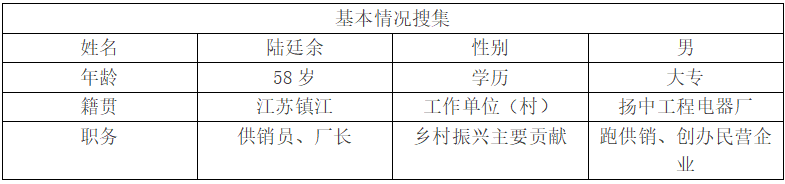

# 镇江
访谈记录

## 国联集团朱西林

**李朔源（采访人）**：您之前是否听说过“四千四万”精神？对“四千四万”精神了解程度如何？

**朱西林（受访人）**：听说过。

**李朔源**：在践行“四千四万”精神的实践中，您的主要经历是怎样的？

**朱西林**：在我的工作经历中，确实也体现了四千四万精神。比如说像我，以前在我们国企下面的一个子公司，主要是搞国有菜篮子工程的。在成立公司之前，我们镇江市的菜市场基本上都是给街道社区经营，后来成立一个百姓惠公司，就是我们要从他们手里面把这个菜市场收回，然后统一管理，由我们百姓惠来管。所以在这过程中呢，经历比较坎坷，因为既要有上级领导的协调，也要有我们自己的团队去对接各个街道地区，去做一些工作。这个我们花了一年的时间。基本上把较长时间原来就散落在外面的国有菜市场全部统一收回了。那么在这个过程当中啊，这个事情比较有示范性，因为跑了好多腿，讲了好多话，所以就比较能体现我们这个四千四万精神。我印象比较深刻的是有一个街道社区，我们跑了十几次啊，协调会开了五六次啊，最终才同意。还有的就是区里面把这个菜市场已经委托给民营企业了，民营企业呢我们就收一点管理费。我们为什么要收取呢?我们跟民营企业的承包人也谈到，当时我们的初衷就是，第一是确保菜篮子的供应，第二个要确保这个食品安全。我们就是要让老百姓买到我们经营的这个菜可追溯。因为我们是每个菜场都配备了测设备，都要进行抽检的，每个摊位我们都是有电子小票的。比如说消费者，你只要扫码都可以跟踪的，你买我这个菜也是可以放心的。一旦有问题，你可以追溯到源头去。在这个过程中呢，我们还做了大量的工作的，现在这个企业呢，确实也在稳步发展。另外呢，就是像我现在这个工程公司，它是一个第三方机构。我们这个公司主要是跟整个的国家的宏观政策走的，比如说城市建设和房地产行业。如果整体环境好的话，我们第三方机构相对来说就会比较好一点。因为我们主要是做工程的跟踪审计、资产评估、科研项目等等，那么相对来说我们市场就容易打开。现在呢，我们也在发展优质服务来提升我们自己的市场竞争力，同时做一些客户端来宣传我
们的企业文化和品牌。

**李朔源**：您是我们的前辈和榜样，借这个机会，想请您给我们广大青年朋友提一些希望和建议，尤其是您认为“四千四万”精神对于年轻一代的企业家和创业者有什么启示和价值吗？

**朱西林**：现在我们时代给了我们一个机遇，当然也是一个挑战。作为年轻人，就是你要选好了你的目标，找准了你的风口，同时贵在坚持。年轻人有可能会有一点浮躁，但是你决定去做了，你就要有韧性坚持。你们可以参考一些很成功的企业家，他们的经历是非常坎坷的。他们也有自己崩溃的边缘，也有放弃的打算，但是最终都是坚持下来的。年轻人趁着你们年轻要不怕摔跤，摔倒了就拍拍身上的灰尘继续前行。年轻人一定要有斗志、要有奋斗的精神。现在新的行业很多，有很多东西并不是说现在没有做过的，我自己就不可以去碰、不可以去想。关键就是要对照国家的宏观政策去明确自我发展的方向。可以去找一些小伙伴建成一个团队，搞一些大家志趣相投的事情。一旦志趣相投，大家心会往一处想，那就会形成一个凝聚力。遇到困难的时候大家一起想办法，不要把困难当做你的绊脚石，该过的河要过，该淌的水要淌，该爬的山要爬。遇水架桥嘛，总会找到解决方法的。

**李朔源**：非常感谢您的配合和支持，我们希望通过这次访谈能够更深入地了解“四千四万”精神的认知、实践现状，为提出“四千四万”精神的传承发展路径提供参考。如果您有任何其他的问题或建议，也请随时告诉我们。再次感谢您的参与！

## 新疆济川建设工程有限公司 徐志锋

**李朔源（采访人）**：您好，我们是南京师范大学马克思主义学院的学生，我们今天来向您做一个采访。我们现在正在进行一项有关“四千四万”精神认知、实践以及传承、发展的调查研究，希望您能抽出时间配合我们做一个简短的访谈，谢谢！请问您之前是否听说过“四千四万”精神？

**徐志锋（受访人）**：听说过。

**李朔源**：“四千四万”精神的含义就是踏尽千山万水、吃尽千辛万苦、说尽千言万语、历尽千难万险，在您的创业过程中是否体现了这些精神？

**徐志锋**：是的。

**李朔源**：您能跟我们分享一下您的创业历程吗？

**徐志锋**：可以的。我是一个从农村走出来的孩子。从学校毕业之后，我从事的是建筑行业。建筑行业，在改革开放初期，从80年代到90年代，一直是我们国家的支柱产业。这个行业在我们当初从学校毕业出来的时候，从一个普通的学生，到社会上一个求知若渴的青年，在单位里需要在工程实践中深化并践行专业知识。在践行的过程中，需要不断把自己个人的意志、专业特长，以及与单位同事，还有上下级一些施工单位的合作，都需要在工作过程中体现。这些仅仅是我们在单位需要进行的一些必要的工作。这些工作在初期对我们来说是很新鲜的，同时我们也面临着很多挑战。因为如果你想要在一个大企业生存下去，需要面对方方面面的，包括社会上的、自己认知范围之内的一些交流。这些交流，从我们个人的能力而言，是有一个界定的，这个界定就是说，我们虽然是建筑行业，但是建筑行业是一门凝固的艺术，这门艺术需要你用自己的汗水、用自己的专业知识去阐述设计师的作品。现在外面的高楼大厦，建筑的外观，形态各异，体现了时代的脉搏、时代的发展。但是在90年代的时候，我们国家的建筑行业还是在发展中前进的，正如我们整个社会也在迂回式前进、螺旋式上升。时代需要创业者，也需要充满意志、不断前行的开拓者，我们有幸成为时代的创业人，在企业中通过自己辛勤的付出，逐渐成长为一个中层管理人员。随着企业不断地发展，以及改革开放成果逐步显现，我国从计划经济逐步转变成市场经济，自从中国加入WTO以后，行业竞争更加激烈，商机无限，竞争无极，在竞争的过程当中，逐步淘汰一系列企业，也会淘汰一部分人，这样的过程可以说是千辛万苦。在千辛万苦的过程中，我们要不断地磨砺自己，就像一首诗说的那样：“千淘万漉虽辛苦，吹尽狂沙始到金。”所以这个过程也是一个沉淀的过程。作为一个创业人，在历史的潮流之中，不进则退，时代在淘汰企业，也在淘汰人，我们也成为被淘汰的一部分人，当然这种淘汰也是响应时代的号召。从央企，我们光荣地下岗了，我们光荣地转岗了，我们要重新认知这个社会，重新感触这个社会的脉搏。我们怎样才能找到自己的一条路？怎样给自己定型定位？在这个过程中，我们“千磨万击还坚劲，任尔东西南北风。”我们追求的是，至少不成为家庭的负担，不成为亲人的负担，也在同事、朋友的眼中，成为一个自强不息的人。这样的自强不息，不是从一个小家而言，不是从一个小单位来看一件事，我们每个人都是一个个体，由无数个体组成了一个单位，身为这样的个体，你要充满正能量，你要影响身边的人，你只有去影响他们，用正能量去带动别人。我们头顶的天空，不是由某一些人撑起来，而是由无数像我们一样努力、不断奋斗的人，去把它撑了起来。因此，我们顺应改革开放的时代潮流，谨记习近平总书记倡导的创业精神，决心创办自己的企业。
据不完全统计，中国的民营企业应该是占到了60%多，将近70%。有一位经济学家说过：中国的企业，中国的经济，由70%多的民营企业，撑起了中国90%多的农民工。民营企业家，在创业的过程中，是充满艰辛的。艰辛的原因部分来自于制度层面，也来自于市场经济的规律，对民营企业是一种考验。在当前的市场形势之下，民营企业面临着很多挑战，也必须承担应尽的社会责任。这种社会责任，是企业只要在正常运行，就需要承担，为国计民生提供一层保障。

**李朔源**：您刚刚说的那些经历对我们有很大的启发。最后，您是我们的前辈和榜样，借这个机会，想请您给我们广大青年朋友提一些希望和建议，尤其是您认为“四千四万”精神对于年轻一代的企业家和创业者有什么启示和价值吗？

**徐志锋**：同时，我们这样的企业还会面临许多不确定因素。比如说“四千四万”精神中有一条是“历尽千难万险”，我想分享一个自己的故事。比如，我国曾经历几年的经济困难局面，这种局面不仅仅对国有企业，也对民营企业，造成了较大的冲击。面临资金链断裂这样的突发事件，对于企业而言，是千难万难，即使有千言万语也难以回避这个实际问题。那么企业怎么去谋发展？对于一个企业的掌门人来说，是一个严峻的考验。有许多企业，比如劳动力密集型、手工业企业在这个困境面前一蹶不振，也有很多企业，顺应时代潮流，积极改革创新，在这个困境面前坚强发展。因此，企业需要具备很强的抗风险能力，这样的风险只能通过企业的效益来化解、寻求一种平衡。我也曾面临这样一个艰难时刻。一个做企业的人，也必须有一种国家精神、家国情怀，我们随时随地可能会面临各种风险。离开央企以后，我创立了自己的公司，我是公司的第一任法人。为什么我在新疆成立一个公司，名叫“济川”呢？因为我的家乡是江苏泰兴，泰兴的简称是“济川”，我以它命名我的企业，也是出于对家乡的一种情怀。一个有情感、有正能量的创业人，他的内心始终是柔软的，一定要不忘家乡山水、不忘生我养我的地方。人在新疆，心系故里。我有幸带领企业度过了那几年经济困难的难关。虽然困难重重，但是我们全体人员节衣缩食，我们身为企业负责人要去不断开拓市场，只有把市场开拓出来，才能把之前留下的窟窿给填补上去，我们要做一个负责任的企业。每一个企业的领头人，包括企业的每一名员工，都是企业大家庭中的成员。而身为企业的管理者，不仅需要把工程质量做好，同时也要向员工传递积极创造个人价值的信念。通过不断地努力，我们取得了新的订单，企业也充满了新的活力，为我们企业在新疆市场、在江苏市场、乃至全国各个省市，开辟了新的项目，度过了几年经济困难带来的难关。
我个人保持着一个良好的习惯，想和大家共勉。作为一个工程人，我想不仅仅是工程人，我们要擅长读书，读万卷书，行万里路。我一直保持着读纸质书的习惯。不管多么忙碌，每年都要读一些书，不局限于我的专业书籍，更多的是一些文学书籍，我个人对文学有所爱好，也喜欢记一记工程日志、生活日志，偶尔也会写一些读后感和书评，和我公司的员工们分享、交流。对我们民营企业来说，企业文化是十分重要的，我给大家分享的是一种文化内涵，是共同创造人生价值的这种信念。我认为个人的成功与社会的发展是密不可分的，我们每个人都应当为社会的发展贡献自己的力量，这也是我们民营企业的社会责任所在。做自己的事情，不仅仅是为了实现个人的人生价值，改善个人的生活，更要带着身边的人一起奋斗，共同成为对社会有贡献的人，我想这是身为民营企业人的骄傲，也是我们为我们国家、这个时代添砖加瓦所尽的一份绵薄之力。
最后，我觉得每个人的能量不仅仅局限于你当初设定的目标，可能在我们从校园迈步的一瞬间，就清零了。著名的艺术大师罗丹曾经说过，每个人应该是一个雕塑，我们不断揉碎自己，再不断塑造自己。这个过程就是我们不断学习、不断读书、不断与别人交流、共享、鼓励的过程，只有我们相互传递正能量，才能把我们曾经经历的千辛万苦、千难万险，化成眼前的康庄大道、光明坦途。前进的路，再险也是平，后退的路，再平也是险。

**李朔源**：好的！非常感谢您的配合，我们青年大学生和企业家会有吃苦的精神和强大的信心，为“四千四万”精神的传承和发展贡献我们的青年力量。
## 兴厦建设集团宗小斌

**李朔源（采访人）**：您之前是否听说过“四千四万”精神？对“四千四万”精神了解程度如何？

**宗小斌（受访人）**：听说过。

**李朔源**：在践行“四千四万”精神的实践中，您的主要经历是怎样的？

**宗小斌**：我1994年毕业之后，当时本来是要到我们泰兴市建工局的。这在当时对于很多人来说是一个非常不错的选择，毕竟事业单位稳定、有保障。然而，我经过一番思考后，最终没有同意，而是选择来到镇江。到镇江来，原来有个叫金工局，我在里面上班，上了半个月就辞职了。当时的想法很简单，家里面好不容易把我培养出来，家里面兄弟姐妹多嘛，兄弟姐妹五个，但是只把我一个人培养出来了。我在这个事业单位里面上班，可能对我自己来说已经是很不错了，但是我没有办法帮衬整个家庭和我的兄弟姐妹们。所以，经过一番权衡，我决定辞职，去寻找更有挑战性和机会的工作。
辞职之后，我进入了一家建筑公司，从施工员开始做起。施工员、造价员、项目经理……整个工程必须的流程我都做过。尤其那个时候我们才刚刚开始工作，我家里经济条件不是那么好。为了能帮衬家里，我在那个公司上班的时候，我晚上还要打六份工，同时在七个单位做事。也就是说晚上有时候甚至会通宵。我的弟弟那时候还是孩子，还在上学，我就觉得应该帮衬家里一点，多出出力。在建筑公司工作的这段时间，我付出了很多，也收获了很多。我在这个建筑公司真正做了11年，这11年里，这过程中也遇到了我的恩人——一个老的民营企业家，他也是我们镇江比较出名的企业家。相对来说，他对我比较关照，当然，关键还是我通过自己的劳动取得了他的信任以及重用。这11年，我不仅积累了丰富的行业经验，也培养了自己坚韧不拔的性格和解决问题的能力。
到2009年的时候，我做出了人生中的第二次重大决定——辞掉公司经理的职位，自己下海创业。我跟我朋友栾总一起创建了我们自己的公司。从那一刻起，我们就要自己去面对各种大风大浪了。这里面酸甜苦辣就很多很多了，真的只有经历过的人才能体会。比如说，我们接手了许多项目，付出了无数的努力，但有时候结果并不如人意，很多项目可能最终付之东流。尽管如此，我们还是尽全力保质保量地去做，因为我们希望得到客户的认可。每一个项目都是我们公司声誉的基石，只有通过不懈的努力，才能赢得客户的信任和支持。那时候交通还不发达，不像现在有高铁，我当时从老家去镇江还是坐的大巴车。我坐在车子上的时候，看着窗外的风景，我就对自己暗暗地发誓，我这辈子我坐这个车子两边跑，第一永远不允许后退，第二不管多么辛苦我一定要成功。我一直认为，再苦再累都不能放弃，即使跌倒也是人生必须的经历。经验就是在跌倒的过程中积累的，每一次失败都是通往成功的阶梯。。
这几年，随着我们工程建设这一块整个大的市场在下行，对于我们来讲也是人生的非常重要的转变吧。应该说2018年、2019年我的人生也很迷茫，因为我们工程建设这一条路不太行得通了。我们不得不重新思考和调整方向。我们也一直很努力地找方向，甚至自己不停地去充电去学习。因为我们要重换战场了，一个新的领域就需要不断地去学习和探索。为了提升自己，我本人也到苏州、杭州去上课培训，学习新的知识和技能。以前我们可能对自媒体这一块的方方面面不是那么熟悉，但是通过疫情之后到现在自己慢慢学习的过程，同时也应该说是一个知识沉淀过程，我们现在慢慢地开始搞包装行业。因为现在物流比较发达嘛，包装行业的市场前景相对来说还是比较好的。另外呢，我们现在在做一个5G贸易项目。5G贸易是我们顺应时代潮流的一个新尝试，我们现在是在海南那边注册，因为海南有自贸区嘛，政策优惠，公司也就顺利开起来了。这个公司，第一个使用的是新的商业模式，第二个就是我们积极地去迎合我们国家的产业政策的调整方向。我们相信，只有紧跟国家政策，才能在新的领域中找到属于自己的机会。这一路走来的经历，虽然充满了艰辛和挑战，但也让我收获了很多经验。只要我们始终坚持自己的信念，不断学习，勇于尝试，就一定能够在新的领域中闯出一片天地，实现自己的人生价值。

**李朔源**：您是我们的前辈和榜样，借这个机会，想请您给我们广大青年朋友提一些希望和建议，尤其是您认为“四千四万”精神对于年轻一代的企业家和创业者有什么启示和价值吗？

**宗小斌**：虽然我的朋友们喊我宗老板，但这个名字背后，其实是无数个日夜的拼搏、无数次的挫折，以及无数次的自我怀疑与坚持。这也体现了我们所有的乡镇企业家也好，民营企业家也好，他风光的背后都隐藏着无数的辛酸与泪水。每一个成功的背后，都是无数次摔倒后的重新站起，都是历经千辛万苦后的坚持与努力。所以说在这一点上我有很深的感悟。我记得好久之前，国家提出了“大众创业、万众创新”的号召，这激发了无数年轻人的创业热情。我也很喜欢跟年轻人一起交谈，分享和倾听创业经验和故事。他们当中有创业成功的，但是不是所有人。当然我不是打击他们，只是想提醒他们，创业之路并不容易。就是很多的大学生他自己出来创业，可能是三代人的钞票给他注册公司，让他进行运营，满怀热情地开始创业。其实，他的文凭是够的，学历很高，理论知识也很扎实，但是他缺少一点历练和经验。哪怕自己没有经验，也可以找一个专业的经纪人过来协助，这都不会造成干了几个月或者一两年就失败的结果。创业失败不仅仅意味着他一个人失败，更可能是整个家庭的失败，甚至会让家庭多年的积蓄付之东流。我的孩子也是刚刚才大学毕业，他前一段时间也给我提起了说想做自媒体。我跟他讲，我可以支持他，但是我给你半年的时间。在这半年里，他需要彻底搞明白自媒体的方方面面。你哪怕到杭州去培训也好，或者是学习也好，一定要把这个行业的来龙去脉从头到尾了解清楚，包括它的盈利模式、发展趋势以及这几年的市场状况弄明白。只有在充分了解这些之后，我说我绝对支持你去创业。归根结底，就是我们每个人创业，第一要有方向，然后在这个方向的基础上，我们自己要有一个沉淀，或者是学习磨练的过程。不是说今天我们国家政策说往哪个方向发展行，明天我就去干，那个成功的几率很小，因为他没有任何企业管理的经验和专业技能。我希望孩子们在毕业之后都能够实现人生理想和目标，但是一定要契合实际。创业并不是一件轻松的事情，它需要勇气、智慧、耐心和坚韧不拔的毅力。年轻人有热情、有想法，这是他们的优势，但同时也要学会脚踏实地，一步一个脚印地去实现自己的目标。不要害怕失败，但也不要盲目冲动。每一次尝试都应该建立在充分的准备和深思熟虑的基础之上。我还想提醒年轻人，创业过程中，团队合作也非常重要。一个人的力量是有限的，但一群志同道合的人汇聚在一起，就能形成强大的合力。找到志趣相投的伙伴，共同面对困难和挑战，相互支持、相互鼓励，这样可以大大提高创业成功的几率。同时，也要学会从失败中吸取教训，每一次跌倒都是成长的机会，每一次挫折都是积累经验的过程。最后，我想说的是，创业是一场马拉松，而不是短跑。它需要我们有足够的耐力和毅力，才能在漫长的道路上坚持下去。不要因为一时的困难而放弃，也不要因为一时的成功而骄傲。保持谦逊、保持学习的态度，不断调整自己的方向和策略，才能在这个竞争激烈的时代中找到属于自己的位置，实现自己的人生价值。

**李朔源**：非常感谢您的配合和支持，我们希望通过这次访谈能够更深入地了解“四千四万”精神的认知、实践现状，为提出“四千四万”精神的传承发展路径提供参考。如果您有任何其他的问题或建议，也请随时告诉我们。再次感谢您的参与！
## 羽田集团赵晨

**李朔源（采访人）**：您好，我们是南京师范大学马克思主义学院的学生，我们今天来向您做一个采访。我们现在正在进行一项有关“四千四万”精神认知、实践以及传承、发展的调查研究，希望您能抽出时间配合我们做一个简短的访谈，谢谢！请问您之前是否听说过“四千四万”精神？

**赵晨（受访人）**：听说过。

**李朔源**：“四千四万”精神的含义就是踏尽千山万水、吃尽千辛万苦、说尽千言万语、历尽千难万险，在您的创业过程中是否体现了这些精神？

**赵晨**：我是1973年出生的，成长在那个充满变革的时代。学校就不谈了。学校的事情就不多说了，当时毕业出来，正好赶上了改革开放的浪潮。那个时代，可以说是充满机遇和挑战，每个人都怀揣着梦想，努力在那个时代里找到自己的方向。当时，我们的企业是乡镇企业，我们的公司当时是金属回收公司，就是把废钢在全国各地采购，送到江苏省，然后再送到上海宝钢三钢五厂、三钢一厂。跟其他公司签订所谓的订货合同，然后再销售。在这个创业的途中呢，我作为公司当时的应该说是业务主力，可以说是吃尽千辛万苦。因为我们作为这个提供原材料的企业，跟大企业打交道是不可避免的。你比方说，我这个“踏进千山万水”，这个“历经千辛万苦”，跑到上海宝钢，干啥？见宝钢的老总，排队，从早上八点排到十点，全是人，整整两个小时才轮到我。宝钢作为一家大型国企，对合作伙伴的要求也是非常严格的。他要考察你企业的资质和实力，只有达到他的标准，他才可能签你合同。包括三钢五厂，我都是本着这个精神吧，历经千山万水，吃尽千辛万苦，我们就是靠着一种信念去完成这个目，最终赢得了很多企业的信任，签下了合同。这种经历，让我深刻体会到了创业的艰辛，也让我明白了，只有坚持不懈，才能在竞争激烈的市场中站稳脚跟。
然后就是在历史的变迁、时代的洪流中，我们慢慢摸索出了一条新的发展道路，进入房地产相关领域发展。当时，我们的企业还很小，只有几个人。我是从江苏羽田工程咨询集团有限公司起步，从几个人然后做到几十号人。虽然说在所谓的这个现代的企业的话，几十号人应该是不算什么，但在镇江这个地级市应该来说，也是相当不容易了。市场竞争是很残酷的，我们不仅要考虑如何生存得更好，还要对员工有所交代，让经营者有所收获。这需要我们深思熟虑，精心谋划。
当然在这过程中，我们所感悟的是什么呢？企业不仅仅是要创造产值、效益，对社会作出贡献的。更重要的是，它能够锻炼我们的能力，历练我们的内心，提升我们的内涵。所谓不怕千辛万苦，要有一种志向，要有一种进取精神。在这个企业的创办和发展当中，这种精神体现得是相当充分的，我们的感悟也是相当深刻的。包括我们的这个宗总，也是感悟很深。
这之后其实有个小插曲。我们到扬州去创业、工作，恰逢一场大暴雨，但我们当时到人家单位门口没有带伞。一场大暴雨，就任它从头到尾淋湿自己。那一刻，我对自己说，我一定要超越自己，就让这场雨来磨练我的斗志，当时真的有这个想法。所以就是说，人的成长它是一个过程，任何事物它是一个过程和规律，最终都会消亡，但是这个奋斗精神它是始终存在的，历朝历代都是存在的。所以说，一个人要有钉子精神，就像《钢铁是怎样炼成的》主人公保尔·柯察金，他那种坚韧不拔、永不言败的精神，一直激励着我们。这是过去的事情，所以我们现在尤其是需要传承这种精神并且有所创新。只有这样，我们才能在新的时代浪潮中，找到属于自己的位置，实现自己的人生价值。在当今这个快速发展的时代，我们不仅要传承前辈们的奋斗精神，还要结合时代的特点，不断创新，不断进取。创业之路从来都不是一帆风顺的，它充满了艰难险阻，充满了未知和挑战。但正是这些困难，才让我们的创业之路更加有意义，更加值得我们去奋斗。每一次的挫折都是成长的机会，每一次的失败都是成功的铺垫。我们要学会在困难中寻找机会，在挫折中汲取力量。

**李朔源**：您刚刚说的那些经历对我们有很大的启发。最后，您是我们的前辈和榜样，借这个机会，想请您给我们广大青年朋友提一些希望和建议，尤其是您认为“四千四万”精神对于年轻一代的企业家和创业者有什么启示和价值吗？

**赵晨**：这个启示和价值真的太大了，就像我刚才讲的那些经历一样。如果用李白的诗来形容的话呢，那真是再贴切不过了。就是如果遇到困难就是“停杯投箸不能食，拔剑四顾心茫然。” 当时就是这样，在创业过程中遇到困难时的那种无助和迷茫。当时，面对重重困难，我们确实有过那种不知所措的时刻。那种感觉就像手中握着一杯酒，却因为内心的焦虑而无法下咽；拔出剑来四顾，却只见一片迷茫，不知道该往哪里去。当然了，我讲的这首诗里还有更贴切的句子：“欲渡黄河冰塞川，将登太行雪满山”。这不正是我们创业路上的真实写照吗？想要渡过黄河，却发现河结冰了；想要爬上太行山，却看到山上都是雪。创业时的这些困难就像一座座大山，横在我们面前，让我们感到无比的艰难和沉重。每一步都像是在荆棘丛中前行，每一步都充满了未知和挑战。但是人最终要豪放一点，人生要豪迈一点。这种精神正是我们在创业过程中所需要的。毛主席曾经说过，“一万年太久，只争朝夕。”这句话激励着我们，要珍惜时间，抓住当下，不要被困难吓倒，不要被挫折打败。我们要有一种豪迈的精神，一种不畏艰难险阻的精神，去面对创业路上的一切困难。我们要相信，困难只是暂时的，只要我们有勇气去面对，就一定能够找到解决的办法。然后李白最后那句说，“行路难，行路难。多歧路，今安在，长风破浪会有时，直挂云帆济沧海。”所以说一定要保持豪迈的精神去创业。虽然行路艰难，虽然困难重重，但只要我们保持豪迈的精神，保持坚定的信念，总有一天，我们会乘长风破万里浪，挂上云帆横渡沧海。无论遇到多大的困难，无论面临多大的挑战，我们都要坚信，只要我们坚持不懈，就一定能够突破困境，实现我们的目标。创业之路从来都不是一帆风顺的，它充满了艰难险阻，充满了未知和挑战。但正是这些困难，才让我们的创业之路更加有意义，更加值得我们去奋斗。
然后呢就是要有一种恒心，一种不达目的不罢休的恒心。当然这种恒心和目的并不是盲目冲动，而是要切合实际的，要脚踏实地的。我们要在豪迈的精神指引下，一步一个脚印地去实现我们的目标。就像宗总说的，创业不是一场短跑，而是一场马拉松。创业之路，就像是一场没有终点的马拉松，它考验着我们的耐力和毅力，它要求我们在面对每一个挑战时，都要有不屈不挠的精神。我们需要有足够的耐力和毅力，才能在漫长的道路上坚持下去。我们要学会在困难面前不退缩，在挫折面前不气馁。每一次的坚持，都是向成功迈进的一步。同时，我们也要明白，目标必须切合实际。不能因为豪迈的精神就盲目乐观，不能因为坚定的信念就盲目冲动。我们要根据自己的实际情况，制定合理的目标和计划。只有这样，我们才能在创业的道路上走得更稳，走得更远。我们要学会在豪迈与务实之间找到平衡，既要敢于梦想，又要脚踏实地。创业之路，是一条充满挑战和考验的道路，它要求我们不仅要有梦想，更要有实现梦想的行动力和执行力。我们要不断地学习，不断地进步，不断地超越自我。只有这样，我们才能在激烈的竞争中立于不败之地，才能在创业的征途上不断前行，最终达到成功的彼岸。

**李朔源**：好的！非常感谢您的配合，我们青年大学生和企业家会培养吃苦的精神，为“四千四万”精神的传承和发展贡献我们的力量。

## 镇江纸业包装公司栾长宏

**李朔源（采访人）**：您好，我们是南京师范大学马克思主义学院的学生，我们今天来向您做一个采访。我们现在正在进行一项有关“四千四万”精神认知、实践以及传承、发展的调查研究，希望您能抽出时间配合我们做一个简短的访谈，谢谢！请问您之前是否听说过“四千四万”精神？

**栾长宏（受访人）**：听说过的。

**李朔源**：“四千四万”精神的含义就是踏尽千山万水、吃尽千辛万苦、说尽千言万语、历尽千难万险，在您的创业过程中是否体现了这些精神？

**栾长宏**：“四千四万”精神在我的创业过程中是有充分体现的。我是大概2000年的时候大学毕业的，那时候正是中国经济飞速发展的时期。我父亲是在八十年代中国第一批的商人企业家，他的创业精神一直深深影响着我。他那种敢于拼搏、勇于创新的精神，从小就在我的心中种下了创业的种子。我当时大学毕业的时候是在镇江那个发改委工作，这个岗位是很稳定的，许多人梦寐以求。但是，我内心深处还是希望继承父辈的创业精神，去开拓属于自己的事业。所以，我就没有去做发改委这个方面的工作，没有选择安逸的工作，而是决定回到家乡，回到扬州，跟我父亲合作办了一个企业。那时候，我满心都是对未来的憧憬和对创业的激情。
在和父亲合作做了两年之后吧，就是因为父辈的一些创业能力和经验吧，确实比较厉害，他们那一代人的毅力和对市场的洞察力确实是很强的，我也从中学到了很多，但是我逐渐意识到，他们跟我们这一代终究还是有一些代沟的。时代在变，市场也在变，我们必须用新的思维和方式去面对新的挑战。大概在2002年，我做出了一个重要的决定，我开始把我的公司跟我爸爸分开来，带着公司的一些骨干和员工去到上海，注册了一家新的公司。
在上海的那几年，是我人生中最难忘的时光。我们从零开始，一步一个脚印地发展。2002年离开家乡时，公司一年的产值只有500多万，但到了2006年，我们已经做到了5000多万的产值了。这五年里，我在我们同龄人中算是非常成功的。那时候，上海作为国际化大都市，流行很多上海品牌嘛。我就把我的企业迁到上海，和上海的研究所合作，然后推出了上海品牌，一下子就打开了全国的销路。那段时间，我们经常开车到处跑业务。我们那时候经常就是动不动开车到云南、到湖北、湖南、安徽、河南、内蒙古、北京……几乎全国各地都留下了我们的足迹。我们到处去找投标，到处去拉业务。那时候的日子虽然辛苦，但充满了激情和希望。我们团队的每一个人，都为了共同的目标而努力奋斗。那种拼搏的精神，至今仍然激励着我。我们经常加班到深夜，甚至通宵达旦，但没有人抱怨，因为我们都相信，只要我们坚持下去，就一定能够实现我们的梦想。
后来2007年之后就是家里的问题吧，我面临了一个重要的抉择。因为我爱人她在公安系统内工作嘛，她的工作性质决定了她无法调动到上海。我们老是两地分居，这对于家庭来说是一个很大的考验。那么我们为了小孩，为了这个家庭，我们经过慎重考虑，后来决定把公司从上海迁回来了，就迁到了镇江，然后在镇江一步步做到现在。回到镇江后，我们一步步地、踏踏实实地发展。我们刚开始是做工厂，从2007年开始我转向工程领域，一直坚持到现在。工程行业也充满了挑战。你知道的，去年开始我们遇到了一些瓶颈，这让我们意识到，我们需要做出一些改变。经过反复思考和讨论，我们去年年底商量还是要彻底地融入乡镇企业，就是在这个产品上做深入一点，专注于产品的深度开发。所以说这次在镇江，我们去年跟开发区一直谈。我们等于是投了几百万美金进去做医疗包装。我们觉得吧，这个领域相对来说会更稳定，也更符合我们未来的发展方向。创业之路虽然充满了艰辛和挑战，但也充满了机遇和希望。每一次的抉择，每一次的坚持，都让我更加坚定自己的信念。我相信，只要我们保持创新的精神，勇于面对挑战，就一定能够在新的领域中闯出一片天地。未来，我们会继续努力，为社会创造更多的价值，也为我们的员工和家庭带来更多的幸福。

**李朔源**：您刚刚说的那些经历对我们有很大的启发。最后，您是我们的前辈和榜样，借这个机会，想请您给我们广大青年朋友提一些希望和建议，尤其是您认为“四千四万”精神对于年轻一代的企业家和创业者有什么启示和价值吗？

**栾长宏（受访人）**：这个，我说说我的观点啊。创业，一直以来都是一个充满诱惑又充满风险的领域。它承载着无数人的梦想与希望，也见证了许多人的挫折与失败。而创业的环境，随着时代的变迁，也在发生着巨大的变化。就是因为以前从20世纪七八十年代到2000年，尤其是到2012年左右，那一段时间中国经济在高速发展，那时候市场充满了空白和机会。许多新的行业和领域不断涌现，等待着人们去开拓。它有很多东西没人去做，或者有新的东西出现，有很多机会。我们那时候，说句不好听的，你是个初中生你都能变成亿万富翁，那么高中生、大学生都可以创业。创业的门槛比较低，机会也很多。但现在的创业环境已经很不一样了。就现在而言的话，说实话创业越来越难。就拿马路边上开的这些店、工厂来说，可能有四五家能赚钱，三四家勉强保本，还有很多在亏钱，随时在倒闭边缘。
现在创业，尤其是对大学生来讲，难度系数已经大大提高了。理科的，如果说跟技术有关的还可以去做做。比如人工智能、大数据、新能源等领域，这些新兴技术行业还在不断发展，有一定的创业空间。这些领域不仅有国家政策的支持，也有比较大的市场需求。文科就不一样了。你像文科专业，我也是文科毕业的嘛，对文科生创业的困境深有体会。文科现在，对你们来说，如果再去创业的话，就太难太难了。以前文科生还可以通过一些服务行业或者创意产业来寻找机会，但现在市场饱和度高，竞争激烈，机会少之又少。比如说，传统的广告、传媒、旅游这些行业，已经趋于饱和，新的进入者很难在短时间内脱颖而出。对于文科生来说，创业的难度真的太大了。我儿子也在南师大，我就觉得，如果创业能干啥呢？我把我的两个酒店给我儿子。原来在南师大大一，他学的旅游管理嘛，大二调专业调到了遥感智能。我之所以支持他转专业，就是想让他学点技术的东西。这样，他未来无论是进入大型企业还是服务于政府部门，都能有更多的机会和选择。
创业真的太难了，现在的市场环境和竞争压力，让创业的门槛越来越高，风险也越来越大。创业真的太难太难。像我和宗总、赵总我们都经历过很多艰难险阻。创业过程中，我们无数次面临困境，甚至有几次都差一点坚持不下去了。那种在困境中挣扎的感觉，只有真正经历过的人才能体会。创业不仅需要勇气和热情，更需要智慧、经验和资源。现在的年轻人，尤其是文科生，如果想创业，一定要谨慎考虑，做好充分的准备，不能盲目跟风。一定要结合自己的专业背景啊、市场需求啊，还有自身的优势，找到适合自己的创业方向。只有这样，才能在现在这种激烈的市场竞争中找到属于自己的机会，实现自己的创业梦想。
我还想提醒大家，创业并不是唯一的出路。在如今这个时代，就业市场也在不断变化和发展。年轻人可以选择进入大型企业积累经验，或者通过学习提升自己的专业技能，为未来的职业发展打下坚实的基础。无论选择创业还是就业，关键是要保持学习的态度，不断提升自己，适应时代的变化。只有这样，才能在这个充满挑战的时代中找到属于自己的位置，实现自己的人生价值。

**李朔源**：好的！非常感谢您的配合，我们青年大学生和企业家会培养吃苦的精神，为“四千四万”精神的传承和发展贡献我们的力量。

## 友好村郭茂祥

**李朔源（采访人）**：您好，我们是南京师范大学马克思主义学院的学生，我们今天来向您做一个采访。我们现在正在进行一项有关“四千四万”精神认知、实践以及传承、发展的调查研究，希望您能抽出时间配合我们做一个简短的访谈，谢谢！请问您之前是否听说过“四千四万”精神？

**郭茂祥（受访人）**：听说过。

**李朔源**：请您跟我们分享一下您的创业过程可以吗？

**郭茂祥**：好的。我是学校毕业以后就到村里面去了，那时候村里没有什么像样的产业，我就想着自己做点事情。我一回来以后，先开始制作一些简单的工作，主要是帮村里的一些小作坊做一些手工活，比如缝制一些简单的布料制品，或者帮忙包装一些农产品。那时候，虽然工作很辛苦，但心里总觉得有希望，毕竟这是自己迈出的第一步。大概过了有一年吧，我开始觉得这样的生活太局限了，于是决定出去跑业务。刚出去跑业务呢，实话说，什么都不懂。第一次跑业务是到山东，那时候是跑那种服装、纸制品这些小的东西。我记得很清楚，那时候出来要拎一个包，还要背一个包，里面装着样品和一些资料。到了地方之后要拼命的赶车。那个时候交通工具还不方便，都是坐公交，到了镇江以后坐火车，一站一站地赶，很多时间都耗费在路上。
像我们第一次到山东的时候，天气挺冷的，还不知道那边这么冷，穿的衣服很少，把人冻得够呛。所以第一次出差就磕磕碰碰的，没怎么跑业务，只跑了一千多块钱的业务。这个也算是人生第一次的感受。那时候住宿什么都不方便，这是我第一次出差的感受。但我知道，凡事都有一个过程，只要坚持下去，总会慢慢好起来的。后来，我就慢慢适应了这种生活。有时候跑业务一天要赶好多趟车。自己出门的时候要带着地图，每天晚上到招待所里面，就要对着地图，把第二天要去那个地方一点一点地圈起来，一天要跑好几个地方。因为那时候跑的速度要快，一个城市一个城市地跑。所以要是在外面待得比较晚了费用就比较大，因为那时候出差在厂里面也就拿个一两百块钱，你还要节约着用，所以就是有时候一两天要赶很多城市，这样才能多跑一些业务，多挣一些钱。
我记得我出去的时候也才十八九岁吧，那时候人生经历也少，没什么经验，历练也少。出去跑商场柜台的时候，因为很多都是女士嘛，那时候就感到害羞，跟她交流地时候不敢看她，最后把东西签完了回头交纸都不知道是谁，不知道对方长什么样，因为不好意思看人家脸。后来慢慢历练，逐渐自己慢慢成熟了。那时候，我基本上是全国各地，你跑得越多，见得越多，你的机会也就越多。所以那个时候一年到头在家里的时间很短，大部分时间都在外面出差，大概就是这个情况。
扬中这两年一开始，和其他地方在争哪个地方最先提出了“四千四万”精神。其实，我觉得这种争论没有太大意义。我就和“四千四万”精神研究组委会说，不要太纠结于是哪个地方率先提出了“四千四万”精神，更多的是要关注扬中人如何践行、如何发展、如何发扬这种精神，更重要的是如何激励当代人去践行“四千四万”精神，把扬中建设得更好、更美。
“四千四万”精神，其实是一种艰苦奋斗、勇于开拓的精神。它代表了我们这一代人创业的艰辛和不易。那时候，我们不怕吃苦，不怕受累，为了一个订单，可以跑遍大半个中国；为了节省开支，可以住最便宜的招待所；为了打开市场，可以忍受客户的冷眼和拒绝。这种精神，是我们这一代人最宝贵的财富。你们做这个研究，一方面是要了解“四千四万”精神的历史背景和内涵，我觉得更多的是要继承和发展新的“四千四万”精神，关注学校在这方面的教育，让孩子们从小就了解这种精神，传承这种精神。既要关注历史上的“四千四万”精神，也要关注新时代的“四千四万”精神，不要拘泥于单一的历史上的“四千四万”精神，这样与纪录片就没太大差别了。

**李朔源**：我们做这个“四千四万”精神项目，实际上有三个词：存史、资政、育人。第一方面，存史，因为很多人去做改革开放史的研究，但是专门去做与乡镇企业发展历史相关的研究的人比较少，所以我们希望通过项目研究丰富史料、宣传历史。第二方面，资政，就是提出政策建议，我们会形成一篇调研报告，内容既包括关于这段历史的史料，也包括对当代的考察报告，比如目前乡镇企业的发展状况、“四千四万”精神传承发展的情况。第三方面，育人，提炼和扩充“四千四万”精神，制作系列微课。
我们在网上搜索资料的时候，发现扬中在这方面也做出了特色的成绩，同时我们也发现无锡也在这方面做出了突出的成就。

**郭茂祥**：我们之前也去无锡那边看过，他们那边属于是践行得很好。我们这边在做的事情，对于扬中“四千四万”精神的传承与发展确实是起到了一些重要的作用。我们当时做这些事情，既是响应党和国家的号召，也是出于我们自己的情怀，最初只是想要把这段历史做一个展示，让大家不要忘记那段历史，后来慢慢要发展这种精神、发扬这种精神，让“四千四万”精神在新时代继续发光发热。

**李朔源**：您刚刚说的那些经历对我们有很大的启发。最后，您是我们的前辈和榜样，借这个机会，想请您给我们广大青年朋友提一些希望和建议，尤其是您认为“四千四万”精神对于年轻一代的企业家和创业者有什么启示和价值吗？

**郭茂祥**：“四千四万”它算是一种精神，就需要去传承。因为扬中这边的“四千四万”精神是源自于我们老一代的企业家业务员包括各行各业的一些开拓者，他们都是“四千四万”精神的亲历者。在那个艰苦的年代，交通不便、信息闭塞，创业的环境极其恶劣。但正是在这样的条件下，老一辈的扬中人凭借着“踏尽千山万水、吃尽千辛万苦、说尽千言万语、历尽千难万险”的“四千四万”精神，一步一个脚印地开拓出了属于扬中的发展之路。他们用双脚丈量大地，用汗水浇灌希望。从最初的走街串巷推销产品，到后来逐步建立起自己的企业、品牌，他们用自己的实际行动诠释了什么是坚韧不拔，什么是开拓进取。他们中的很多人，起初只是普通的业务员，背着沉重的样品包，穿梭在各个城市之间。为了节省开支，他们常常选择最便宜的交通方式，甚至不惜步行几十里路；为了争取一个客户，他们不厌其烦地介绍产品，哪怕被拒绝无数次也毫不气馁；为了打开市场，他们绞尽脑汁，想尽一切办法。正是这种不服输的精神，让他们在激烈的市场竞争中站稳了脚跟。
我希望我们年轻的一代，包括我们年轻企业家作为新的一代创业者，还是要发扬一些我们老一辈的传统，不能忘了我们的初心。这种精神，不应该随着岁月的流逝而被遗忘，而应该在新的时代背景下焕发出新的活力。这个时代是充满机遇和挑战的时代，创业环境也更加复杂。但无论时代如何变迁，“四千四万”精神的核心价值永远不会过时。年轻一代的创业者们，应该从老一辈的奋斗历程中汲取力量，学习他们那种不畏艰难、勇于开拓的精神。在创业过程中，可能会遇到各种各样的困难和挫折，但只要我们坚持“四千四万”精神，就没有克服不了的困难。我希望年轻一代的创业者们，能够深刻理解“四千四万”精神的内涵，将其融入到自己的创业实践和经历当中去。在“四千四万”精神的鼓舞下，为各行各业的发展做出卓越的贡献。不要忘记，我们今天的成就，是站在老一辈人的肩膀上取得的。我们要用实际行动去继承他们的意志，发扬他们的精神。

**李朔源**：非常感谢您的配合和支持，我们希望通过这次访谈能够更深入地了解“四千四万”精神的认知、实践现状，为提出“四千四万”精神的传承发展路径提供参考。如果您有任何其他的问题或建议，也请随时告诉我们。再次感谢您的参与！
## 镇江市兴生电器有限公司孔宪祥

**李朔源（采访人）**：您好，我们是南京师范大学马克思主义学院的学生，我们今天来向您做一个采访。我们现在正在进行一项有关“四千四万”精神认知、实践以及传承、发展的调查研究，希望您能抽出时间配合我们做一个简短的访谈，谢谢！请问您之前是否听说过“四千四万”精神？

**孔宪祥（受访人）**：当然听说过。“四千四万”精神，那是我们老一辈人在改革开放初期奋斗历程的真实写照。

**李朔源**：“四千四万”精神的含义就是踏尽千山万水、吃尽千辛万苦、说尽千言万语、历尽千难万险，在您的创业过程中是否体现了这些精神？

**孔宪祥**：是的，有比较深刻的体现。

**李朔源**：您能跟我们分享一下您的创业历程吗？

**孔宪祥**：当然。我的故事，其实也是千千万万普通人在改革开放浪潮中奋斗的缩影。一开始，我是做手艺活的，具体来说，就是做瓦工。那时候，虽然工作辛苦，但心里总觉得有一股劲，总觉得能靠自己的双手拼出一片天地。每天清晨，天还没亮，我就背着工具包出发了，手上磨出了厚厚的茧子，但从未有过一丝抱怨。因为我知道，这不仅仅是谋生，更是一种对生活的执着。随着改革开放的潮流，秉持着“四千四万”精神，1984年，我做出了人生中一个重要的决定——加入了村里的供销队伍，负责销售我们本村生产的各类产品。那时候，交通不像现在这么便利，信息也不发达。我们跑供销的人，只能靠着两条腿和一张嘴，走遍千山万水，去寻找市场和客户。记得第一次出门，心里既紧张又兴奋。我们供销队伍里基本都是像我这样的初中毕业生，文化程度不高，但我们都有着一股不服输的劲头。每次出去跑供销，一去就是二十多天，每天都要省吃俭用，因为费用有限。我们常常是早上吃一碗面，中午啃个馒头，晚上再随便吃点东西。住宿条件也很差，有时候只能住在小旅社，甚至有时候就在火车站的候车室里将就一晚。
那时候，我们不光是跑供销，还得兼顾家里的农田。农闲的时候出去跑业务，农忙的时候就得回家种地。记得有一次，刚在外面跑完业务，回到家就赶上插秧的季节。我顾不上休息，直接下到田里，和家人一起忙活。虽然累得腰都直不起来，但看到绿油油的秧苗，心里还是充满了成就感。这种两头兼顾的生活，虽然辛苦，但也让我更加懂得生活的不易。
到了90年代，我们村开始转行做电器销售。那时候的经济压力是很大的，因为报酬与业务费是挂钩的，很多费用都需要自行承担。我记得有一次，为了争取一个大订单，我连续几天几夜都在外面奔波。那时候交通不便，我从一个城市赶到另一个城市，有时候为了赶时间，连饭都顾不上吃。有一次，我为了见一个客户，从早上出发，一直折腾到深夜，连轴转了十几个小时。好在最终成功签下了合同。签下合同的那一刻，我深深地体会到了“四千四万”精神中的“历尽千难万险”的滋味。我们这一代人真的是吃尽了千辛万苦，当时刚好处于改革开放初期，正在转型的时候，既要兼顾农村人，还要兼顾创业出去跑业务的人。
后来改革开放到了中期，国家重视和鼓励创业，可以说是赶上了创办企业的潮流。但办企业也不是一件容易的事，资金、市场、管理等方方面面都需要我们自己去面对和解决。在这个过程中，我更加深刻地体会到了“四千四万”精神的重要性。资金是首要的问题，我们办厂基本都是自己投入资金，第一要考虑自己企业的生产，不仅仅是考虑自己一个家庭，要考虑很多家庭，要让自己的工人能够生存。而且到年终的时候，很多发出去的货款是一时收不回来的，向银行贷款也要保障每个月能够还得起银行的利息。所以我们承担的压力实际上是很大的，但是我们没有放弃。记得有一次，企业面临资金链断裂的危机，我急得像热锅上的蚂蚁。那时候，银行贷款的利息越来越高，而货款又迟迟收不回来。我每天都在想尽各种办法，四处奔波，找亲戚朋友借钱，甚至抵押了自己的房子。那段时间，我几乎夜不能寐，头发也白了不少。但我知道，我不能放弃，我不能让跟着我的工人失望，不能让他们的家庭陷入困境。于是，我咬紧牙关，坚持了下来。经过几个月的努力，终于挺过了难关，企业也逐渐走上了正轨。从那时候起，我就更加明白了“四千四万”精神的深刻含义。这不仅仅是一种吃苦耐劳的精神，更是一种坚韧不拔、永不放弃的精神。在创业的道路上，我们会遇到各种各样的困难，但只要我们坚持“四千四万”精神，就没有克服不了的困难。我们这一代人，就是在这种精神的鼓舞下，一步一个脚印地走到了今天，并且走得越来越好。
现在，回首往事，虽然充满了艰辛，但也充满了成就感。我们用自己的双手，用自己的智慧，为家乡的发展贡献了一份力量。我希望年轻一代的创业者们，能够继承和发扬这种精神，不要忘记我们的初心。在“四千四万”精神的鼓舞下，为各行各业的发展做出卓越的贡献。无论时代如何变迁，这种精神都永远不会过时。它将永远激励着我们，让我们在创业的道路上，走得更远，走得更稳。

**李朔源**：您刚刚说的那些经历对我们有很大的启发。最后，您是我们的前辈和榜样，借这个机会，想请您给我们广大青年朋友提一些希望和建议，尤其是您认为“四千四万”精神对于年轻一代的企业家和创业者有什么启示和价值吗？

**孔宪祥**：我想说的是，“四千四万”精神是我们老一辈人在改革开放初期奋斗历程中形成的宝贵精神财富。它告诉我们，无论遇到什么困难和挑战，都要保持坚定的信念和勇气，去踏尽千山万水、吃尽千辛万苦、说尽千言万语、历尽千难万险。它是我们这一代人奋斗的真实写照，也是我们留给后辈的最珍贵的财富。这种精神对于年轻一代的企业家和创业者来说同样具有重要意义。我希望广大青年朋友们能够继承和发扬“四千四万”精神，勇敢地面对创业和生活中的各种挑战。要坚定信念、勇于担当、敢于创新、不怕困难。
首先，要坚定信念。创业之路从来都不是一帆风顺的，会遇到各种各样的困难和挫折。但只要我们有决心，有勇气，就一定能够战胜困难，走向成功。就像老一辈创业者们一样，他们凭借着坚定的信念，在艰苦的环境中坚持了下来，最终取得了成功。年轻一代的创业者们，也应该在心中树立起坚定的信念，无论遇到什么困难，都不轻易放弃。其次，要勇于担当。创业不仅仅是为自己谋生，更是为社会创造价值。我们要有责任感，敢于担当，不仅要对自己的企业负责，更要对员工、对客户、对社会负责。就像老一辈创业者们一样，他们在创业过程中，不仅要考虑自己的企业，还要考虑员工的生计，考虑客户的利益。这种担当精神，是创业成功的重要保障。再次，要敢于创新。在当今这个快速发展的时代，创新是企业发展的核心动力。年轻一代的创业者们，要敢于突破传统，敢于尝试新的方法和模式。要善于学习，善于思考，用创新的思维去解决创业过程中遇到的各种问题。只有不断创新，才能在激烈的市场竞争中保持领先地位。最后，要不怕困难。创业的道路上，困难和挑战是不可避免的。但只要我们有勇气，有毅力，就一定能够克服困难，走向成功。就像老一辈创业者们一样，他们在创业过程中，经历了无数的困难和挫折，但他们从未放弃，最终取得了成功。年轻一代的创业者们，也应该在面对困难时，保持乐观的心态，勇敢地去面对，去克服。同时，也要注重学习和提升自己的综合素质和能力水平，以适应不断变化的市场环境和社会需求。只有这样，才能在激烈的竞争中立于不败之地，为实现个人价值和社会进步贡献自己的力量。
李朔源：非常感谢您的配合和支持，我们希望通过这次访谈能够更深入地了解“四千四万”精神的认知、实践现状，为提出“四千四万”精神的传承发展路径提供参考。如果您有任何其他的问题或建议，也请随时告诉我们。再次感谢您的参与！

## 扬中工程电器厂陆廷余

**李朔源（采访人）**：您之前是否听说过“四千四万”精神？对“四千四万”精神了解程度如何？

**陆廷余（受访人**）：听说过，那都是我们亲身经历的事情，尤其在我们扬中市体现得特别明显。

**李朔源**：在践行“四千四万”精神的实践中，您的主要经历是怎样的？

**陆廷余**：84年初期，我们从学校毕业，怀揣着对未来的憧憬，开始走入社会谋生。回来以后，我的父辈们语重心长地跟我说，要学习一门手艺，就比如木工、瓦工、裁缝等等，这些基本的工作可以养家糊口。我们刚从学校毕业，也是血气方刚，不甘心就拿着微薄的工资、挣那一点点辛苦钱。幸运的是，我们赶上改革开放的好时代，这是一个充满机遇的时代，到处都充满了希望和活力。
扬中市地理位置独特，四面环江，两头在外，资源从外面进来，销路从扬中出去，这种得天独厚的条件为我们提供了非常好的发展空间。那时候有一大批像我这样的年轻人，选择领着包，走南闯北、走千家万户，去开拓自己的事业。我记得我当年第一站去了东北，从镇江上车的时候，车厢里人山人海，连个座位都没有，我只能站着。这一站就是十多个小时，一直到济南，有时候甚至站到天津才有座位坐下。站几十个小时真的很辛苦，但是没办法。有时候晚上赶车，只能带报纸铺在绿皮火车座位底下休息。我们到一个地方下车，双腿又酸又麻，身体很疲惫，但是没办法，那时候交通不便，这就是我们必须要经历的艰苦。有时候晚上赶车，车厢里灯光昏暗，我只能带几张报纸，铺在绿皮火车座位底下，凑合着休息一会儿。第二天醒来，整个人都僵硬了，可还得继续赶路。
我们到了一个地方，第一件事就是找旅馆住下来。那时候条件简陋，旅馆也很简朴，但只要能有个落脚的地方，我们就很满足了。住下之后，就开始翻电话簿，看一些厂商企业的电话号码、地址。我们扬中那时候是搞仪表阀门、桥架的，所以我们就需要找化工企业。在电话簿上找到地址后，就坐公交车去。那时候公交车也很慢，一路颠簸，有时候还要换好几趟车。到了地方，远远看见有高烟囱，就知道那里可能有化工厂，就朝着高烟囱的方向走。但有很多时候，过去一看，走到了人家的后门，后门就没办法进去，化工厂厂房都特别大，从这个门绕到那个门，要走很远的路。
我记得去山西大同铝厂的时候，从我们住的旅馆出发，坐13路车到终点站下车。眼看着烟囱就在跟前了，就朝着那个方向去。我心想这下总算到了，结果那个门不是供外来人员进出的门，没办法，只好从旁边绕过去。就这一家工厂，我们跑了一整天。早上八点多出门，坐公交一个多小时，到那儿又走了一个多小时，结果人家下班了。我们就只能找个小饭馆简单吃点午饭，吃过饭后，再绕了一个多小时才到正门，到那儿刚好人家吃过午饭上班。我们好不容易找到了设备供应科，结果人家科长下午去市里办事了，要很晚回来。我们只能在那边一直等，一直等到下午四点多钟科长才回来，没跟他说几句话，他就下班了。去这个工厂的经历让我印象很深刻，也让我深刻体会到了跑供销的艰辛。
我们那时候交流很不方便，只有数字模拟机，不像现在信息这么灵通。说实话，我们那时候跑供销吃尽了千辛万苦，踏遍千山万水。但尽管如此，我们还是凭借着自己的努力和坚持，跑到了全国各地，结识了许多客户，也积累了一些资金。我们跑供销赚了点钱，回来之后，觉得这条路太辛苦了，加上我们也有业务基础，就领了一帮人准备自己创业。自己创业有什么好处呢，就是能带动周边的人就业，增加他们增收渠道。所以我们创办了沪光器械桥架厂，主要生产桥架，从桥架方面做起，逐步拓展到做仪表阀门，然后又扩大到做开关、变压器，一步一步把企业做大。然而，后来我们才发现，企业也不是这么好干的。没有业务要找业务，自己的业务满足不了整个厂整年的生产，就要找其他的业务员，请他把业务放我这边做，这样我最起码能把工人养活。每年的业务情况都不一样，有好有坏。有时候订单多得忙不过来，有时候订单又很少。但不管怎样，我们都坚持下来了。只有工人稳定了，整个厂才能长远发展。
除了稳定工人，我们还意识到要创建自己的品牌。只有有了自己的品牌，出去之后才能打响自己的名声，才能在激烈的市场竞争中脱颖而出。品牌也是要靠业务员到处宣传的，所以业务员在扬中经济发展过程中占有很重要的地位。如果说没有扬中的供销员，扬中的产品很难推销出去。以前大家只知道扬州，不知道扬中，我们就跟人家说，我们是扬中的，扬子江中间的一个小岛，我们是个县级市。人家问有什么特产，我们说没什么特产，但来我们这边可以吃河豚鱼，那可是扬中的特色美食。后来我们队伍慢慢壮大之后，才有了一个工程电器厂。所以我认为“四千四万”精神在我们扬中企业身上体现得淋漓尽致。这种精神是我们扬中人骨子里的坚韧和执着，是我们扬中企业在市场竞争中不断发展壮大、走向成功的关键所在。

**李朔源**：您是我们的前辈和榜样，借这个机会，想请您给我们广大青年朋友提一些希望和建议，尤其是您认为“四千四万”精神对于年轻一代的企业家和创业者有什么启示和价值吗？

**陆廷余**：“四千四万”精神不仅仅是一种精神，我认为它更是一种灵魂，是我们扬中人骨子里的坚韧与执着，是我们扬中企业在市场竞争中不断发展壮大、走向成功的关键所在。这种精神，是我们那个时代造就的，它深深地烙印在我们这代人的血液里，成为我们面对困难时永不言败的动力源泉。我时常跟我们小年轻讲，我们那个年代是特殊的，改革开放的浪潮为我们带来了机遇，也带来了挑战。我们经历了无数的艰难险阻，但凭借着“四千四万”精神，我们一路披荆斩棘，闯出了一片天地。如果我现在要把我们那时候传统的做法让你们年轻人照搬照抄，那显然是不合适的。时代在进步，社会在发展，新的技术和新的商业模式不断涌现，年轻人需要与时俱进，用新的方法去开拓新的道路。但有一点是不变的，那就是我们那种“四千四万”精神，这种精神是永远不会过时的，它依然值得你们去学习和传承。
我觉得年轻人就要时刻提醒自己，我是这个社会的一份子，我不能仅仅满足于现状，我要去拼搏，去努力，为社会做出自己的贡献。无论是在工作中，还是在生活中，都要时刻保持这种积极向上的态度。既然有“四千四万”精神，我觉得我们扬中人就要把这种精神世世代代流传下去，让它成为我们扬中人的精神象征，成为我们扬中这片土地上最宝贵的财富。我们亲历者有义务将这种精神传承下去，我们有责任把我们的经历和感悟讲给下一代听，但是光靠我们是不够的，还是要通过学校从小灌输这样的理念。学校是培养下一代的重要场所，通过教育，可以让孩子们从小就树立正确的价值观和人生观，让他们明白什么是“四千四万”精神。我希望我们扬中年轻人一定要记得这个“四千四万”精神，将这种精神传承下去。无论你们未来从事什么职业，无论你们身处何方，都要时刻铭记这种精神。当你们遇到困难时，想想我们的前辈们是如何在艰苦的条件下，凭借着“四千四万”的精神，一步步走向成功的。当你们感到迷茫时，想想这种精神，它会给你指引方向。当你们取得成就时，也别忘了这种精神，它是我们扬中人的骄傲，是我们扬中人的灵魂所在。

**李朔源**：非常感谢您的配合和支持，我们希望通过这次访谈能够更深入地了解“四千四万”精神的认知、实践现状，为提出“四千四万”精神的传承发展路径提供参考。如果您有任何其他的问题或建议，也请随时告诉我们。再次感谢您的参与！

## 江苏亿能电气集团	周桂根
https://mp.weixin.qq.com/s/hyzsDiVsczECxbjOR4UcFg

## 友谊国际集团	陈吕荣
https://mp.weixin.qq.com/s/hyzsDiVsczECxbjOR4UcFg

## 江苏通灵电器股份有限公司	严荣飞
https://mp.weixin.qq.com/s/wlvpkWFDFxEZu8OUwdFrng

## 建华建材	王刚
https://mp.weixin.qq.com/s/dkvfH7H66TDNyjaUK2o69A

## 江苏鸿晨集团有限公司	张荭
https://mp.weixin.qq.com/s/RL1O0hl3A3sB-i49-XWfpQ

## 明月镜片	谢公晚
https://mp.weixin.qq.com/s/XPjS_OrsksHlZFbmJgHtmA
